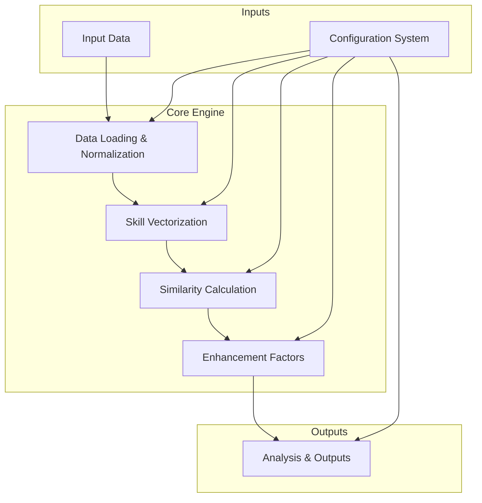
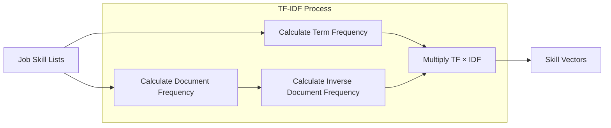
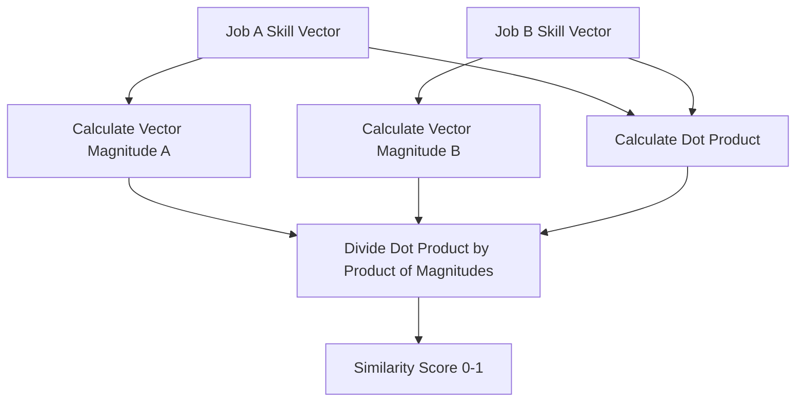
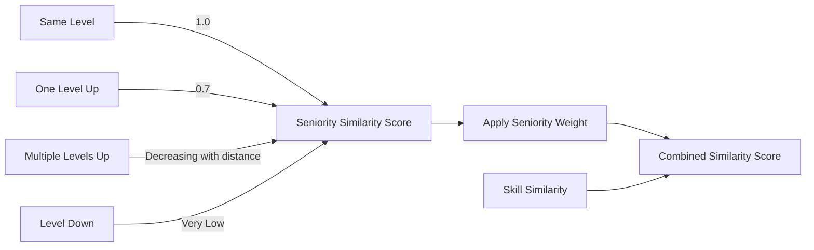
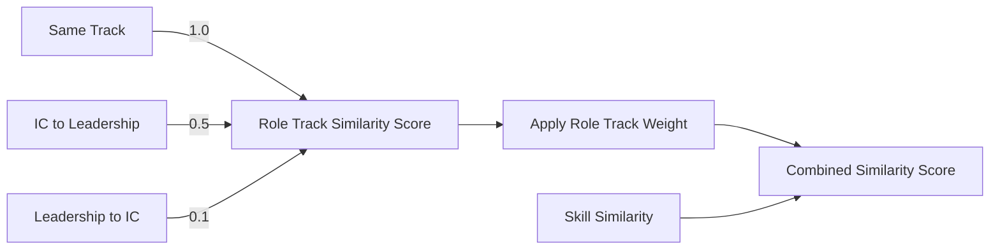
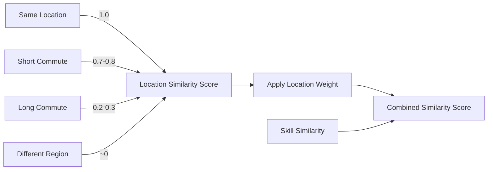
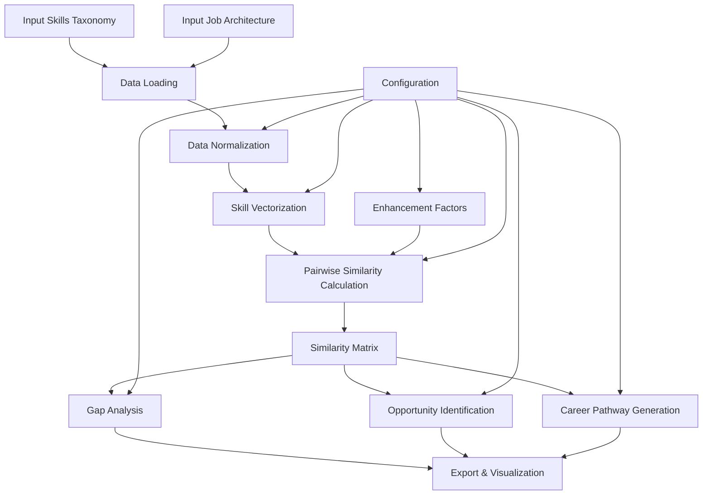
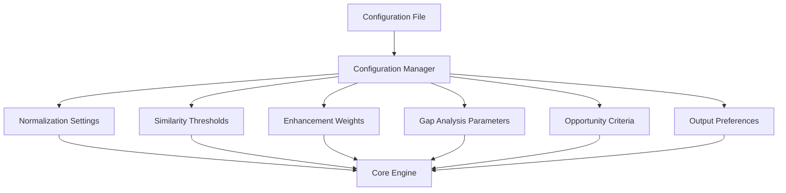
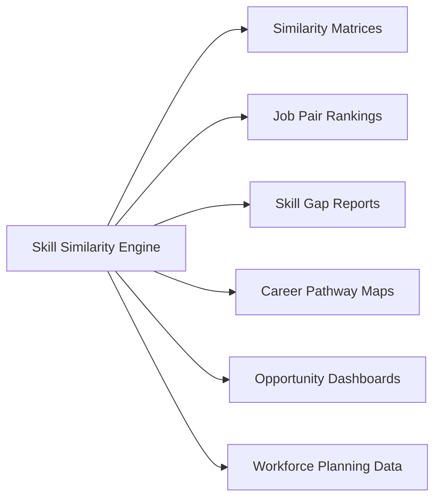

# Skill Similarity Engine: Technical Overview

> **Note on Flowcharts**: This document contains Mermaid flowcharts which may not render correctly in all markdown viewers. To view these diagrams:
> 1. Use a Mermaid-compatible markdown viewer (VS Code with Markdown Preview Mermaid extension, GitHub, GitLab, etc.)
> 2. Or paste the Mermaid code into the [Mermaid Live Editor](https://mermaid.live)
> 3. Or convert the markdown to HTML/PDF with a tool that supports Mermaid

## Table of Contents

1. [Introduction](#introduction)
2. [System Architecture](#system-architecture)
3. [Core Methodologies](#core-methodologies)
   - [TF-IDF Vectorization](#tf-idf-vectorization)
   - [Cosine Similarity](#cosine-similarity)
   - [Similarity Enhancements](#similarity-enhancements)
4. [Data Flow & Processing](#data-flow--processing)
5. [Configuration System](#configuration-system)
6. [Key Outputs & Insights](#key-outputs--insights)
7. [Use Cases](#use-cases)
8. [Technical Details](#technical-details)

## Introduction

The Skill Similarity Engine is a sophisticated analytics system designed to analyze job roles based on their skill requirements and identify similarities, progression paths, and reskilling opportunities. This document provides a technical overview of how the engine works, its core methodologies, and the insights it can deliver.

The engine addresses key talent management challenges by:

- Identifying similar roles across the organization
- Suggesting potential career paths based on skill similarity
- Calculating skill gaps between roles
- Supporting workforce planning through quantitative skill analysis
- Enabling data-driven decisions for talent mobility

## System Architecture

The Skill Similarity Engine follows a modular architecture with distinct components handling different aspects of the data processing and analysis pipeline.



### Key Components

1. **Data Models**: Core representations for skills, jobs, and their relationships
2. **Vectorization**: Transformation of skill data into numerical vectors
3. **Similarity Calculators**: Algorithms for comparing skill vectors
4. **Analysis Modules**: Gap analysis, opportunity identification, and pathway generation
5. **Configuration System**: Controls for all aspects of the engine's behavior
6. **Export & Visualization**: Output generation for downstream consumption

## Core Methodologies

### TF-IDF Vectorization

Term Frequency-Inverse Document Frequency (TF-IDF) is a numerical statistic used to represent the importance of skills within job roles. The engine uses TF-IDF to convert skills into vectors that can be compared mathematically.

#### How TF-IDF Works

1. **Term Frequency (TF)**: Measures how frequently a skill appears in a job description
2. **Inverse Document Frequency (IDF)**: Provides a weight based on how rare a skill is across all jobs
3. **TF-IDF Score**: Combines these values to give higher weight to distinctive skills



#### Practical Example

Consider two roles: Data Scientist and Software Engineer

**Data Scientist skills**:
- Python (common across many roles)
- Statistics (more specific to analytical roles)
- Machine Learning (relatively specialized)

**Software Engineer skills**:
- Python (common across many roles)
- Java (common in development roles)
- Unit Testing (common in development roles)

When vectorized using TF-IDF:
- Python receives a lower weight because it appears in many job roles
- Machine Learning receives a higher weight because it's more distinctive
- This weighting ensures that specialized skills have more influence on similarity calculations

### Cosine Similarity

Cosine similarity measures the cosine of the angle between two non-zero vectors, providing a similarity score between -1 and 1 (in practice, with TF-IDF vectors, the values range from 0 to 1).

#### How Cosine Similarity Works

The cosine similarity between two vectors A and B is calculated as:

```
Similarity = (A·B) / (||A|| × ||B||)
```

Where:
- A·B is the dot product of vectors A and B
- ||A|| and ||B|| are the magnitudes (Euclidean norms) of vectors A and B



#### Advantages of Cosine Similarity

- **Scale Invariance**: Focuses on skill composition rather than absolute numbers
- **Angles vs. Magnitudes**: Measures similarity in skill direction, not just quantity
- **Efficient Computation**: Relatively fast to calculate for sparse vectors
- **Intuitive Results**: Scores range from 0 (completely different) to 1 (identical)

### Similarity Enhancements

While skill-based similarity provides a strong foundation, the engine incorporates additional factors that influence real-world job transitions:

#### 1. Seniority Enhancement

Recognizes that career progression typically follows incremental level increases:



#### 2. Role Track Enhancement

Accounts for transitions between individual contributor and leadership roles:



#### 3. Location Enhancement

Recognizes that geographic proximity affects job transition practicality:



## Data Flow & Processing

The complete data flow through the engine follows these steps:



### Key Data Transformations

1. **Raw Input → Data Models**: Structured representation of skills and jobs
2. **Skills → Vectors**: Numerical representation using TF-IDF
3. **Vectors → Similarity Scores**: Pairwise comparisons using cosine similarity
4. **Similarity Scores → Enhanced Scores**: Application of additional factors
5. **Enhanced Scores → Analysis Results**: Generation of insights and recommendations
6. **Analysis Results → Output Formats**: Transformation to consumable formats

## Configuration System

The engine features a comprehensive configuration system that controls all aspects of its behavior:



Key configuration areas include:

1. **Normalization**: Controls how skill data is standardized
2. **Similarity**: Defines thresholds and calculation methods
3. **Enhancements**: Weights for seniority, role track, and location
4. **Gap Analysis**: Parameters for identifying and scoring skill gaps
5. **Opportunity**: Criteria for flagging high-potential transitions
6. **Reporting**: Output format specifications

## Key Outputs & Insights

The engine produces various outputs that can be used for different talent management purposes:



### 1. Similarity Matrices

Complete job-to-job similarity scores that show how all roles relate to each other.

**Business Value**: 
- Comprehensive view of organizational role relationships
- Foundation for all other analyses
- Identification of unexpected similarities across departments

### 2. Job Pair Rankings

For each job, the top N most similar roles ranked by similarity score.

**Business Value**:
- Targeted career guidance for employees
- Identification of lateral move opportunities
- Support for job family design and career architecture

### 3. Skill Gap Reports

Detailed breakdown of skill differences between roles, including:
- Missing skills needed for transition
- Surplus skills not required in target role
- Development effort estimates

**Business Value**:
- Targeted learning and development planning
- Reskilling program design
- Career transition planning

### 4. Career Pathway Maps

Multi-step progression paths showing possible career journeys.

**Business Value**:
- Long-term career planning
- Talent mobility strategy development
- Succession planning support

### 5. Opportunity Dashboards

Highlighted role transitions that meet specific criteria, such as:
- High similarity scores (easy transitions)
- Strategic skill alignment with business needs
- Critical role coverage

**Business Value**:
- Strategic workforce planning
- Proactive talent mobility initiatives
- Addressing skill shortages

## Use Cases

The Skill Similarity Engine supports various talent management use cases:

### 1. Career Development & Mobility

**Example**: A Data Analyst wants to explore career options.
- The engine identifies related roles (Business Analyst, Data Scientist, etc.)
- Shows skill gaps for each potential transition
- Provides development plans for different paths

### 2. Organizational Design

**Example**: A business unit is being restructured.
- The engine shows job clustering by skill similarity
- Identifies redundant roles that could be consolidated
- Highlights missing capabilities in the current structure

### 3. Succession Planning

**Example**: A critical role will have upcoming vacancies.
- The engine identifies internal roles with high similarity
- Shows development needs for potential successors
- Suggests interim placement options

### 4. Workforce Planning

**Example**: An organization needs to shift resources to growing areas.
- The engine identifies transition opportunities from declining to growing areas
- Shows reskilling requirements and effort
- Helps prioritize development investments

## Technical Details

The Skill Similarity Engine is implemented as a Python package with the following characteristics:

- **Language**: Python 3.8+
- **Core Dependencies**: numpy, pandas, scikit-learn, matplotlib/seaborn
- **Configuration**: YAML-based with strong typing
- **Interface**: Command-line interface with batch processing
- **Output Formats**: CSV, JSON, Excel, visualizations
- **Integration**: Power BI compatibility for dashboards

The modular architecture allows for:
- Easy extension with new similarity algorithms
- Addition of new enhancement factors
- Integration with various data sources
- Customization of analysis and reporting

---

*This document provides a high-level overview of the Skill Similarity Engine. For detailed implementation specifications, refer to the technical documentation and API reference.* 