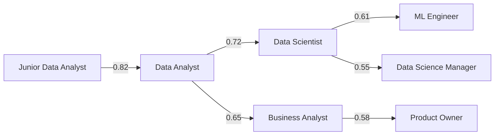
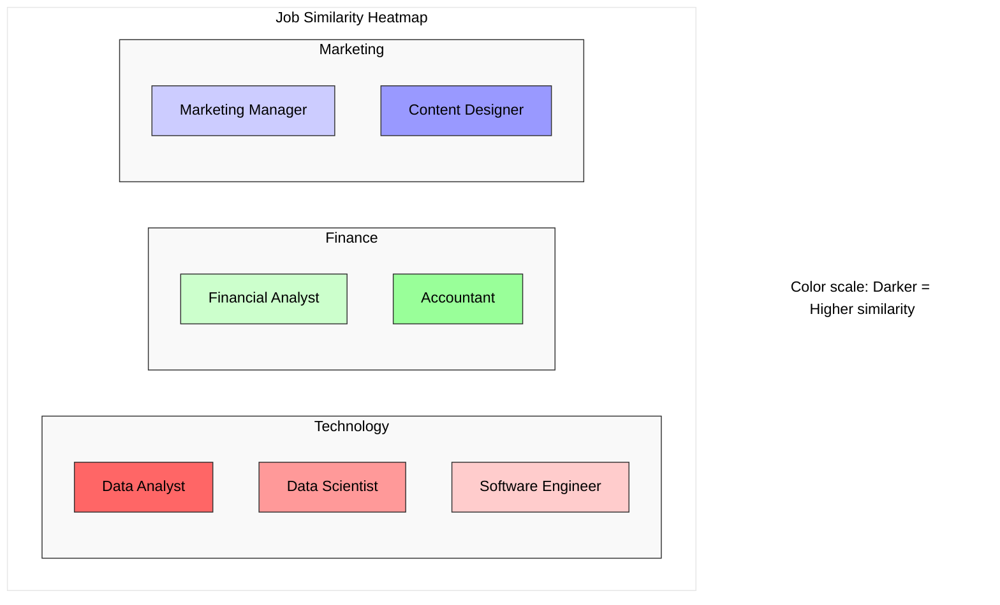
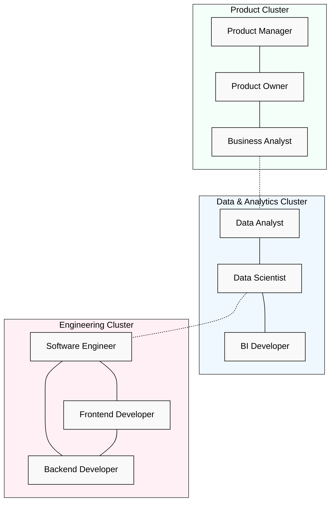
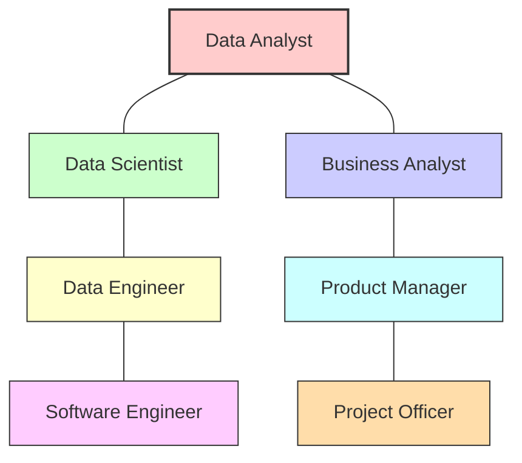
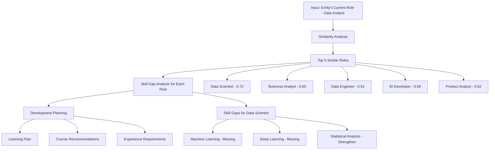
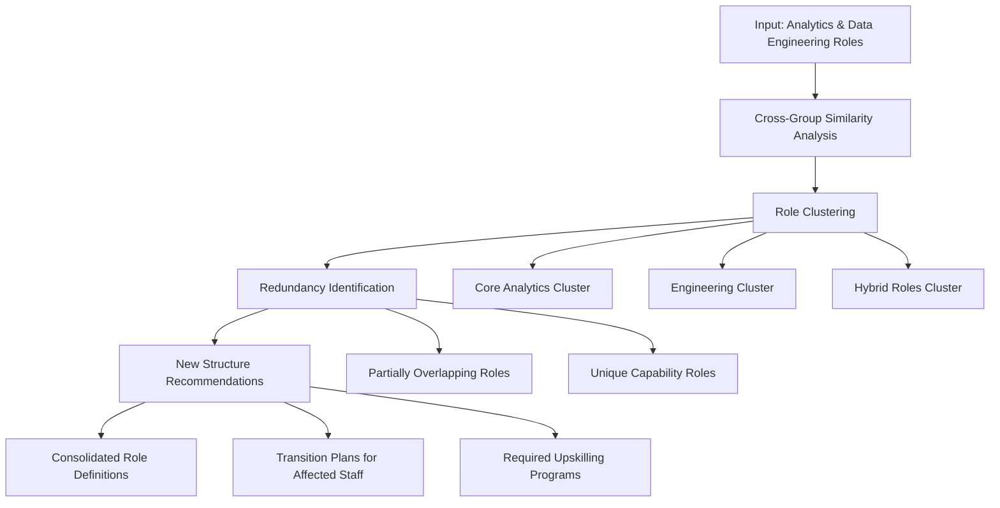
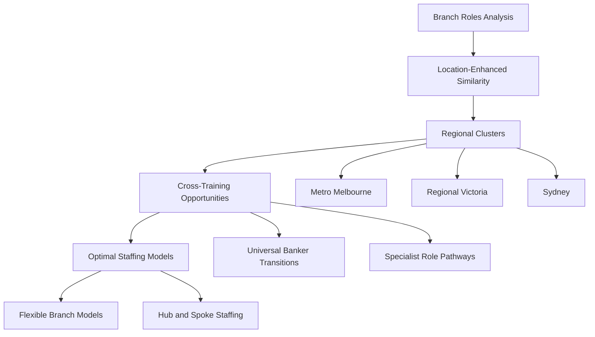
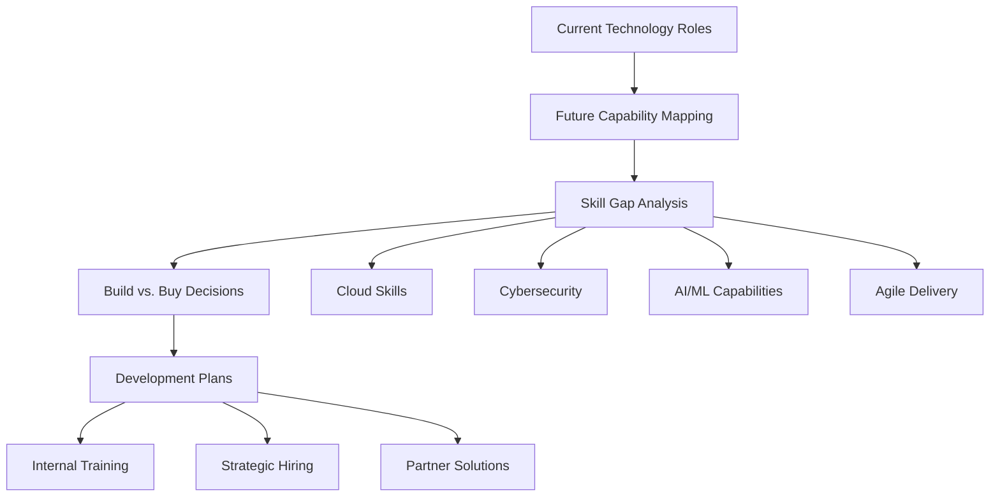
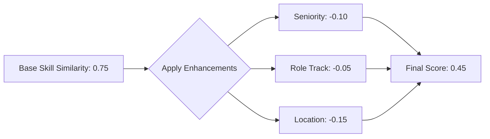

# Skill Similarity Engine: Practical Applications & Visualizations

> **Note on Flowcharts**: This document contains Mermaid flowcharts which may not render correctly in all markdown viewers. To view these diagrams:
> 1. Use a Mermaid-compatible markdown viewer (VS Code with Markdown Preview Mermaid extension, GitHub, GitLab, etc.)
> 2. Or paste the Mermaid code into the [Mermaid Live Editor](https://mermaid.live)
> 3. Or convert the markdown to HTML/PDF with a tool that supports Mermaid

## Table of Contents

1. [Introduction](#introduction)
2. [Understanding Engine Outputs](#understanding-engine-outputs)
3. [Visualization Examples](#visualization-examples)
4. [Real-World Applications](#real-world-applications)
5. [NAB-Specific Use Cases](#nab-specific-use-cases)
6. [Integration with Power BI](#integration-with-power-bi)
7. [Interpreting Results](#interpreting-results)

## Introduction

This document provides a practical guide to the outputs and applications of the Skill Similarity Engine, focusing on real-world examples and visualizations. It's designed to help business users understand how to interpret and apply the engine's results to solve talent management challenges at NAB.

## Understanding Engine Outputs

The Skill Similarity Engine produces several key outputs that serve different business purposes:

### Similarity Matrices

**What it is**: A complete matrix showing similarity scores between all job pairs.

**How to read it**: 
- Rows and columns represent jobs
- Each cell contains a similarity score (0-1)
- Higher scores (darker colors) indicate greater similarity

**Example visualization**:

```
| Job        | Data Analyst | Data Scientist | Business Analyst |
|------------|--------------|----------------|------------------|
| Data Analyst   | 1.00         | 0.72           | 0.65             |
| Data Scientist | 0.72         | 1.00           | 0.48             |
| Business Analyst| 0.65        | 0.48           | 1.00             |
```

### Top Similar Jobs

**What it is**: For each job, a ranked list of the most similar roles.

**How to read it**:
- Jobs are ranked by similarity score
- Additional columns show enhancement factors (seniority, role track, location)
- Gap information shows skill differences

**Example visualization**:

```
Top matches for: Data Analyst (Job ID: J001)

1. Data Scientist (0.72)
   - Skills to gain: Machine Learning, Deep Learning
   - Skills not needed: SQL Reporting, Excel
   - Seniority change: +1 level

2. Business Analyst (0.65)
   - Skills to gain: Requirements Gathering, User Stories
   - Skills not needed: Data Visualization, R Programming
   - Seniority change: 0 levels
```

### Skill Gap Reports

**What it is**: Detailed analysis of skill differences between jobs.

**How to read it**:
- "Missing skills" are those needed for the target role
- "Surplus skills" are those in the current role but not needed in the target
- Development effort estimates the difficulty of transition

**Example visualization**:

```
Skill Gap: Data Analyst → Data Scientist

Missing Skills:
1. Machine Learning (Proficiency: 4) - High importance
2. Deep Learning (Proficiency: 3) - Medium importance
3. Model Deployment (Proficiency: 2) - Low importance

Surplus Skills:
1. SQL Reporting (Proficiency: 4)
2. Excel Advanced Functions (Proficiency: 3)

Development Effort: 68 points (Moderate)
Estimated Training Time: 6-9 months
```

### Career Pathway Maps

**What it is**: Multi-step progression options showing possible career journeys.

**How to read it**:
- Nodes represent jobs
- Edges show similarity and transition difficulty
- Multiple paths show alternative routes

**Example visualization**:



## Visualization Examples

### Heatmap Visualizations

Similarity matrices are often visualized as heatmaps, where color intensity represents similarity strength:

**Department-Level Heatmap**:



**Job Clustering Visualization**:

Job clustering groups similar roles together, often revealing cross-functional opportunities:



### Skill Similarity Network

A network visualization showing relationships between jobs based on skill similarity:



## Real-World Applications

### Career Development Example

**Scenario**: Emily is a Data Analyst in the Technology department looking for her next career move.

**Engine Analysis Process**:



**Output**: Personalized career path options with specific development plans for each potential transition.

### Organizational Restructuring Example

**Scenario**: The Analytics department is being merged with Data Engineering.

**Engine Analysis Process**:



**Output**: Optimized organizational structure with clear role definitions and transition paths for affected employees.

## NAB-Specific Use Cases

### Branch Network Optimization

Using location-enhanced similarity to analyze roles across NAB's branch network:



### Technology Transformation

Supporting NAB's digital transformation by identifying technology capability needs:



## Integration with Power BI

The Skill Similarity Engine's outputs can be directly loaded into Power BI dashboards for interactive analysis:

### Example Dashboard Components

1. **Role Similarity Explorer**
   - Select a role and see similar roles with filtering capabilities
   - Drill down into skill gap details
   - Toggle between different enhancement weights

2. **Career Pathway Visualizer**
   - Interactive network diagram showing possible career moves
   - Filtering by department, level, and location
   - "What-if" scenario planning tool

3. **Workforce Planning Dashboard**
   - Heat map of role similarities across the organization
   - Identification of high-mobility groups
   - Skills inventory and gap analysis

4. **Location Impact Analysis**
   - Map visualization of role distribution
   - Location-based filtering of career opportunities
   - Commute-based similarity analysis

## Interpreting Results

### Understanding Similarity Scores

Similarity scores range from 0 to 1, with typical interpretations:

- **0.8-1.0**: Highly similar roles (potentially redundant or easy transitions)
- **0.6-0.8**: Moderately similar (good transition opportunities with some training)
- **0.4-0.6**: Somewhat similar (viable transitions with significant development)
- **0.2-0.4**: Limited similarity (challenging transitions requiring major reskilling)
- **0.0-0.2**: Very different roles (not practical transition paths without complete retraining)

### Enhancement Factor Impact

When enhancement factors are applied, understanding their influence is important:



In this example, a role with good skill match (0.75) has significant reductions due to:
- Seniority gap (possibly multiple levels difference)
- Role track change (e.g., IC to leadership)
- Location difference (requiring relocation or long commute)

This produces a final score of 0.45, indicating a much more challenging transition than the skill match alone would suggest.

### Skill Gap Interpretation

Skill gaps should be evaluated based on:

1. **Gap count**: Total number of missing skills
2. **Gap depth**: How much development is needed for each skill
3. **Strategic importance**: Whether the missing skills are core vs. peripheral
4. **Development difficulty**: Some skills are harder to develop than others

A practical rule of thumb is:
- **Low effort** (< 30 points): Could be addressed with short courses or on-the-job training
- **Moderate effort** (30-70 points): Requires dedicated training programs over months
- **High effort** (> 70 points): Major reskilling needed, potentially a year or more

## Conclusion

The Skill Similarity Engine provides powerful analytical capabilities for talent management at NAB. By combining sophisticated algorithms with business context, it enables data-driven decisions about career pathways, organizational design, and workforce planning.

For detailed instructions on using the engine's command-line interface and configuring the analysis parameters, refer to the CLI documentation and user guides.

---

*This practical guide is designed to be read alongside the technical overview document for a complete understanding of the Skill Similarity Engine.* 