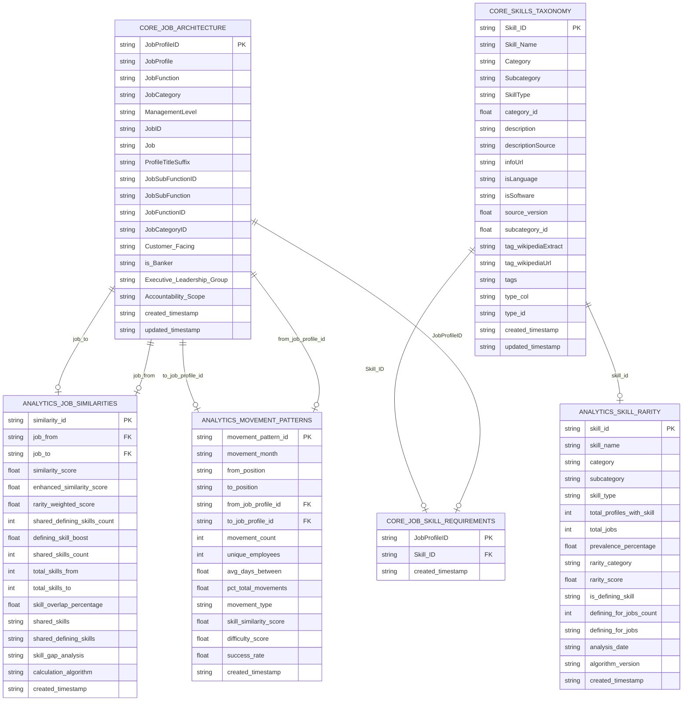

# 🗄️ SQLite Schema Design for NAB Skill Similarity Engine
## 💼 Workforce Intelligence Database

**📅 Generated**: 2025-08-09 17:58:08

**📂 Database File**: `models\2025-Q3\business_context.sqlite`

**💾 Database Size**: 355.45 MB

**⚙️ SQLite Version**: 3.45.3

**🕒 Last Modified**: 2025-08-09T14:28:18.373256

---

## 📋 Table of Contents

### Quick Navigation
- [📊 Database Overview](#-database-overview)
- [🎯 Quick Reference](#-quick-reference-for-llms)
- [📈 Performance Analysis](#-performance-analysis)
- [🔗 Entity Relationship Diagram](#-entity-relationship-diagram)
- [📋 Table Definitions](#-table-definitions)
- [🔍 Data Distributions](#-key-data-distributions)
- [⚡ Query Patterns](#-common-query-patterns)
- [🏷️ Business Context](#-business-context-guide)

### 📊 Tables by Category

#### 🏗️ Core Data Tables

- [core_job_architecture](#core-job-architecture) - 715 records
- [core_job_skill_requirements](#core-job-skill-requirements) - 40,170 records
- [core_skills_taxonomy](#core-skills-taxonomy) - 38,525 records
- [core_workforce_current](#core-workforce-current) - 35,000 records

#### 📊 Analytics Tables

- [analytics_bundle_characteristics](#analytics-bundle-characteristics) - 27 records
- [analytics_job_defining_skills](#analytics-job-defining-skills) - 19,460 records
- [analytics_job_families](#analytics-job-families) - 715 records
- [analytics_job_similarities](#analytics-job-similarities) - 510,510 records
- [analytics_movement_patterns](#analytics-movement-patterns) - 25,608 records
- [analytics_pathway_predictions](#analytics-pathway-predictions) - empty records
- [analytics_skill_bundles](#analytics-skill-bundles) - 2,057 records
- [analytics_skill_demand_trends](#analytics-skill-demand-trends) - empty records
- [analytics_skill_rarity](#analytics-skill-rarity) - 2,059 records
- [analytics_specialized_skills](#analytics-specialized-skills) - empty records

#### ⚙️ System Tables

- [sys_schema_metadata](#sys-schema-metadata) - 22 records


---

## 📊 Database Overview

This document provides comprehensive schema documentation for the NAB Skill Similarity Engine SQLite database.
The database integrates job architecture, skill taxonomies, workforce context, movement analysis, and pre-computed similarities
to support career pathway analysis, workforce planning, and strategic workforce intelligence.

### 📈 Quick Stats
- **Total Tables**: 15
- **Total Records**: 674,868
- **Database Size**: 355.45 MB


## 🔗 Entity Relationship Diagram

[⬆️ Back to Table of Contents](#-table-of-contents)

Interactive ERD showing table relationships and key columns:



### Alternative Text-Based Relationship Map

*If the Mermaid diagram above doesn't render, here's a text-based view:*

**🏗️ Core Data Tables:**

• **core_job_architecture** (715 records)
  - Primary Key: JobProfileID

• **core_job_skill_requirements** (40,170 records)
  - Primary Key: JobProfileID, Skill_ID
  - References: → core_skills_taxonomy, → core_job_architecture

• **core_skills_taxonomy** (38,525 records)
  - Primary Key: Skill_ID

• **core_workforce_current** (35,000 records)
  - Primary Key: employee_number
  - References: → core_job_architecture

**📊 Analytics Tables:**

• **analytics_bundle_characteristics** (27 records)
  - Primary Key: cluster_id

• **analytics_job_defining_skills** (19,460 records)
  - Primary Key: job_profile_id, skill_id
  - References: → core_skills_taxonomy, → core_job_architecture

• **analytics_job_families** (715 records)
  - Primary Key: job_profile_id, cluster_id
  - References: → core_job_architecture

• **analytics_job_similarities** (510,510 records)
  - Primary Key: similarity_id
  - References: → core_job_architecture, → core_job_architecture

• **analytics_movement_patterns** (25,608 records)
  - Primary Key: movement_pattern_id
  - References: → core_job_architecture, → core_job_architecture

• **analytics_pathway_predictions** (0 records)
  - Primary Key: prediction_id
  - References: → core_job_architecture, → core_job_architecture

**🔗 Key Relationships:**

• analytics_job_defining_skills.skill_id → core_skills_taxonomy.Skill_ID
• analytics_job_defining_skills.job_profile_id → core_job_architecture.JobProfileID
• analytics_job_families.job_profile_id → core_job_architecture.JobProfileID
• analytics_job_similarities.job_to → core_job_architecture.JobProfileID
• analytics_job_similarities.job_from → core_job_architecture.JobProfileID
• analytics_movement_patterns.to_job_profile_id → core_job_architecture.JobProfileID
• analytics_movement_patterns.from_job_profile_id → core_job_architecture.JobProfileID
• analytics_pathway_predictions.to_job_profile_id → core_job_architecture.JobProfileID
• ... and 8 more relationships

## 📋 Table Definitions

[⬆️ Back to Table of Contents](#-table-of-contents)

### 1. **analytics_bundle_characteristics** - 27 records
<a name="analytics-bundle-characteristics"></a>

```sql
CREATE TABLE analytics_bundle_characteristics (
    cluster_id INTEGER PRIMARY KEY,
    bundle_name TEXT,
    bundle_description TEXT,
    bundle_rationale TEXT,
    bundle_size INTEGER,
    sample_skills TEXT,
    sample_job_functions TEXT,
    core_skills TEXT,
    peripheral_skills TEXT,
    dominant_category TEXT,
    category_purity REAL,
    application_level TEXT,
    specialization_area TEXT,
    average_jobs_per_skill REAL,
    taxonomy_alignment_score REAL,
    silhouette_score REAL,
    intra_bundle_cohesion REAL,
    inter_bundle_separation REAL,
    business_value_score REAL,
    training_feasibility TEXT,
    skill_complementarity REAL,
    market_demand_level TEXT,
    common_job_families TEXT,
    typical_career_stage TEXT,
    skill_acquisition_difficulty TEXT,
    clustering_algorithm TEXT,
    algorithm_parameters TEXT,
    quality_validation_date TEXT,
    business_review_date TEXT,
    created_timestamp TEXT
);
```

**Column Statistics:**

- **cluster_id**: 27 unique values (27 non-null), range 0 - 26
- **bundle_name**: 27 unique values (27 non-null), avg length 48.11
- **bundle_description**: 27 unique values (27 non-null), avg length 72.04
- **bundle_rationale**: 27 unique values (27 non-null), avg length 42.04
- **bundle_size**: 24 unique values (27 non-null), range 3 - 456
- **sample_skills**: 27 unique values (27 non-null), avg length 67.44
- **sample_job_functions**: 1 unique values (27 non-null), avg length 16.0
- **core_skills**: 0 unique values (0 non-null), avg length 0
- **peripheral_skills**: 0 unique values (0 non-null), avg length 0
- **dominant_category**: 27 unique values (27 non-null), avg length 22.04
- **category_purity**: 1 unique values (27 non-null), range 1.0000 - 1.0000, avg 1.0000
- **application_level**: 1 unique values (27 non-null), avg length 8.0
- **specialization_area**: 27 unique values (27 non-null), avg length 22.04
- **average_jobs_per_skill**: 26 unique values (27 non-null), range 3.0000 - 47.5938, avg 13.9283
- **taxonomy_alignment_score**: 1 unique values (27 non-null), range 0.8000 - 0.8000, avg 0.8000
- **silhouette_score**: 1 unique values (27 non-null), range 0.0000 - 0.0000, avg 0.0000
- **intra_bundle_cohesion**: 0 unique values (0 non-null), range 0.0000 - 0.0000, avg 0.0000
- **inter_bundle_separation**: 0 unique values (0 non-null), range 0.0000 - 0.0000, avg 0.0000
- **business_value_score**: 0 unique values (0 non-null), range 0.0000 - 0.0000, avg 0.0000
- **training_feasibility**: 0 unique values (0 non-null), avg length 0
- **skill_complementarity**: 0 unique values (0 non-null), range 0.0000 - 0.0000, avg 0.0000
- **market_demand_level**: 0 unique values (0 non-null), avg length 0
- **common_job_families**: 0 unique values (0 non-null), avg length 0
- **typical_career_stage**: 0 unique values (0 non-null), avg length 0
- **skill_acquisition_difficulty**: 0 unique values (0 non-null), avg length 0
- **clustering_algorithm**: 0 unique values (0 non-null), avg length 0
- **algorithm_parameters**: 0 unique values (0 non-null), avg length 0
- **quality_validation_date**: 0 unique values (0 non-null), avg length 0
- **business_review_date**: 0 unique values (0 non-null), avg length 0
- **created_timestamp**: 19 unique values (27 non-null), avg length 26.0

**Sample Records:**

**Record 1:**
  - **cluster_id**: 0
  - **bundle_name**: Analysis Skills Bundle (91 skills)
  - **bundle_description**: Collection of Analysis skills with 3.1% average prevalence
  - **bundle_rationale**: Grouped by Analysis category
  - **bundle_size**: 91
  - **sample_skills**: Customer Centricity; Data Analysis; Data Literacy
  - **sample_job_functions**: Analysis pending
  - **core_skills**: NULL
  - **peripheral_skills**: NULL
  - **dominant_category**: Analysis
  - **category_purity**: 1.0
  - **application_level**: Advanced
  - **specialization_area**: Analysis
  - **average_jobs_per_skill**: 22.428571428571427
  - **taxonomy_alignment_score**: 0.8
  - **silhouette_score**: 0.0
  - **intra_bundle_cohesion**: NULL
  - **inter_bundle_separation**: NULL
  - **business_value_score**: NULL
  - **training_feasibility**: NULL
  - **skill_complementarity**: NULL
  - **market_demand_level**: NULL
  - **common_job_families**: NULL
  - **typical_career_stage**: NULL
  - **skill_acquisition_difficulty**: NULL
  - **clustering_algorithm**: NULL
  - **algorithm_parameters**: NULL
  - **quality_validation_date**: NULL
  - **business_review_date**: NULL
  - **created_timestamp**: 2025-08-08T13:51:05.605307

**Record 2:**
  - **cluster_id**: 1
  - **bundle_name**: Business Skills Bundle (434 skills)
  - **bundle_description**: Collection of Business skills with 5.2% average prevalence
  - **bundle_rationale**: Grouped by Business category
  - **bundle_size**: 434
  - **sample_skills**: Stakeholder Engagement; Change Management; Constructive Feedback
  - **sample_job_functions**: Analysis pending
  - **core_skills**: NULL
  - **peripheral_skills**: NULL
  - **dominant_category**: Business
  - **category_purity**: 1.0
  - **application_level**: Advanced
  - **specialization_area**: Business
  - **average_jobs_per_skill**: 36.86405529953917
  - **taxonomy_alignment_score**: 0.8
  - **silhouette_score**: 0.0
  - **intra_bundle_cohesion**: NULL
  - **inter_bundle_separation**: NULL
  - **business_value_score**: NULL
  - **training_feasibility**: NULL
  - **skill_complementarity**: NULL
  - **market_demand_level**: NULL
  - **common_job_families**: NULL
  - **typical_career_stage**: NULL
  - **skill_acquisition_difficulty**: NULL
  - **clustering_algorithm**: NULL
  - **algorithm_parameters**: NULL
  - **quality_validation_date**: NULL
  - **business_review_date**: NULL
  - **created_timestamp**: 2025-08-08T13:51:05.640235

**Record 3:**
  - **cluster_id**: 2
  - **bundle_name**: Media and Communications Skills Bundle (59 skills)
  - **bundle_description**: Collection of Media and Communications skills with 4.6% average prevalence
  - **bundle_rationale**: Grouped by Media and Communications category
  - **bundle_size**: 59
  - **sample_skills**: Strategic Communication; Technical Report; Effective Communication
  - **sample_job_functions**: Analysis pending
  - **core_skills**: NULL
  - **peripheral_skills**: NULL
  - **dominant_category**: Media and Communications
  - **category_purity**: 1.0
  - **application_level**: Advanced
  - **specialization_area**: Media and Communications
  - **average_jobs_per_skill**: 33.186440677966104
  - **taxonomy_alignment_score**: 0.8
  - **silhouette_score**: 0.0
  - **intra_bundle_cohesion**: NULL
  - **inter_bundle_separation**: NULL
  - **business_value_score**: NULL
  - **training_feasibility**: NULL
  - **skill_complementarity**: NULL
  - **market_demand_level**: NULL
  - **common_job_families**: NULL
  - **typical_career_stage**: NULL
  - **skill_acquisition_difficulty**: NULL
  - **clustering_algorithm**: NULL
  - **algorithm_parameters**: NULL
  - **quality_validation_date**: NULL
  - **business_review_date**: NULL
  - **created_timestamp**: 2025-08-08T13:51:05.644039

*... and 2 more sample records*

---

### 2. **analytics_job_defining_skills** - 19,460 records
<a name="analytics-job-defining-skills"></a>

```sql
CREATE TABLE analytics_job_defining_skills (
    job_profile_id TEXT PRIMARY KEY,
    skill_id TEXT PRIMARY KEY,
    skill_name TEXT,
    job_profile TEXT,
    category TEXT,
    subcategory TEXT,
    skill_type TEXT,
    prevalence_percentage REAL,
    total_profiles_with_skill INTEGER,
    rarity_category TEXT,
    defining_skill_rank INTEGER,
    defining_skill_score REAL,
    analysis_date TEXT,
    percentile_threshold REAL,
    created_timestamp TEXT
);
```

**Foreign Key Relationships:**

- `skill_id` → `core_skills_taxonomy.Skill_ID`
- `job_profile_id` → `core_job_architecture.JobProfileID`

**Column Statistics:**

- **job_profile_id**: 715 unique values (19,460 non-null), avg length 7.0
- **skill_id**: 2,034 unique values (19,460 non-null), avg length 20.0
- **skill_name**: 2,034 unique values (19,460 non-null), avg length 21.53
- **job_profile**: 309 unique values (19,460 non-null), avg length 22.46
- **category**: 29 unique values (19,460 non-null), avg length 16.21
- **subcategory**: 241 unique values (19,460 non-null), avg length 20.41
- **skill_type**: 3 unique values (19,460 non-null), avg length 16.6
- **prevalence_percentage**: 108 unique values (19,460 non-null), range 0.1400 - 89.7900, avg 3.6839
- **total_profiles_with_skill**: 108 unique values (19,460 non-null), range 1 - 642
- **rarity_category**: 4 unique values (19,460 non-null), avg length 5.12
- **defining_skill_rank**: 47 unique values (19,460 non-null), range 1 - 47
- **defining_skill_score**: 108 unique values (19,460 non-null), range 10.2098 - 99.8601, avg 96.3167
- **analysis_date**: 1 unique values (19,460 non-null), avg length 10.0
- **percentile_threshold**: 1 unique values (19,460 non-null), range 8.8000 - 8.8000, avg 8.8000
- **created_timestamp**: 1 unique values (19,460 non-null), avg length 19.0

**Sample Records:**

**Record 1:**
  - **job_profile_id**: R0001.5
  - **skill_id**: KS1215K6H2C5BNN63SHB
  - **skill_name**: Infor LX
  - **job_profile**: Payment Systems Analyst - 5
  - **category**: Business
  - **subcategory**: Business Operations
  - **skill_type**: Specialized Skill
  - **prevalence_percentage**: 1.96
  - **total_profiles_with_skill**: 14
  - **rarity_category**: Rare
  - **defining_skill_rank**: 18
  - **defining_skill_score**: 98.04195804195804
  - **analysis_date**: 2025-08-07
  - **percentile_threshold**: 8.8
  - **created_timestamp**: 2025-08-07 02:14:35

**Record 2:**
  - **job_profile_id**: R0001.5
  - **skill_id**: KS441036Q8YQ0P81GPB0
  - **skill_name**: Strategic Partnership
  - **job_profile**: Payment Systems Analyst - 5
  - **category**: Business
  - **subcategory**: Business Strategy
  - **skill_type**: Specialized Skill
  - **prevalence_percentage**: 3.22
  - **total_profiles_with_skill**: 23
  - **rarity_category**: Rare
  - **defining_skill_rank**: 25
  - **defining_skill_score**: 96.78321678321679
  - **analysis_date**: 2025-08-07
  - **percentile_threshold**: 8.8
  - **created_timestamp**: 2025-08-07 02:14:35

**Record 3:**
  - **job_profile_id**: R0001.5
  - **skill_id**: ESED90D9CF0E0C9F8D28
  - **skill_name**: Business Advisory
  - **job_profile**: Payment Systems Analyst - 5
  - **category**: Business
  - **subcategory**: Business Strategy
  - **skill_type**: Specialized Skill
  - **prevalence_percentage**: 2.24
  - **total_profiles_with_skill**: 16
  - **rarity_category**: Rare
  - **defining_skill_rank**: 20
  - **defining_skill_score**: 97.76223776223776
  - **analysis_date**: 2025-08-07
  - **percentile_threshold**: 8.8
  - **created_timestamp**: 2025-08-07 02:14:35

*... and 2 more sample records*

---

### 3. **analytics_job_families** - 715 records
<a name="analytics-job-families"></a>

```sql
CREATE TABLE analytics_job_families (
    job_profile_id TEXT PRIMARY KEY,
    job_profile TEXT,
    job_function TEXT,
    job_sub_function TEXT,
    job_category TEXT,
    management_level TEXT,
    cluster_id INTEGER PRIMARY KEY,
    cluster_name TEXT,
    cluster_description TEXT,
    cluster_rationale TEXT,
    cluster_size INTEGER,
    sample_jobs TEXT,
    sample_skills TEXT,
    cluster_confidence REAL,
    silhouette_score REAL,
    intra_cluster_similarity REAL,
    inter_cluster_distance REAL,
    clustering_algorithm TEXT,
    algorithm_parameters TEXT,
    analysis_date TEXT,
    created_timestamp TEXT
);
```

**Foreign Key Relationships:**

- `job_profile_id` → `core_job_architecture.JobProfileID`

**Column Statistics:**

- **job_profile_id**: 715 unique values (715 non-null), avg length 7.0
- **job_profile**: 309 unique values (715 non-null), avg length 22.48
- **job_function**: 22 unique values (715 non-null), avg length 19.57
- **job_sub_function**: 110 unique values (715 non-null), avg length 17.58
- **job_category**: 4 unique values (715 non-null), avg length 10.87
- **management_level**: 8 unique values (715 non-null), avg length 7.02
- **cluster_id**: 18 unique values (715 non-null), range 0 - 17
- **cluster_name**: 13 unique values (715 non-null), avg length 39.98
- **cluster_description**: 18 unique values (715 non-null), avg length 78.1
- **cluster_rationale**: 1 unique values (715 non-null), avg length 86.0
- **cluster_size**: 16 unique values (715 non-null), range 5 - 116
- **sample_jobs**: 18 unique values (715 non-null), avg length 75.78
- **sample_skills**: 1 unique values (715 non-null), avg length 23.0
- **cluster_confidence**: 2 unique values (715 non-null), range 0.1270 - 0.1390, avg 0.1387
- **silhouette_score**: 1 unique values (715 non-null), range 0.1157 - 0.1157, avg 0.1157
- **intra_cluster_similarity**: 1 unique values (715 non-null), range 0.0000 - 0.0000, avg 0.0000
- **inter_cluster_distance**: 1 unique values (715 non-null), range 0.0000 - 0.0000, avg 0.0000
- **clustering_algorithm**: 1 unique values (715 non-null), avg length 6.0
- **algorithm_parameters**: 1 unique values (715 non-null), avg length 30.0
- **analysis_date**: 1 unique values (715 non-null), avg length 10.0
- **created_timestamp**: 1 unique values (715 non-null), avg length 26.0

**Sample Records:**

**Record 1:**
  - **job_profile_id**: R0001.5
  - **job_profile**: Payment Systems Analyst - 5
  - **job_function**: Data & Analytics
  - **job_sub_function**: Data Governance
  - **job_category**: Support
  - **management_level**: Group 2
  - **cluster_id**: 17
  - **cluster_name**: Facilities & Administration - Group 2 Cluster
  - **cluster_description**: Diverse cluster of 75 roles spanning 21 job functions with shared competencies
  - **cluster_rationale**: Clustered based on cross-functional skill similarities despite different job functions
  - **cluster_size**: 75
  - **sample_jobs**: Payment Systems Analyst - 5; Settlement Officer - 6; Customer Service Representative - 0
  - **sample_skills**: Skills analysis pending
  - **cluster_confidence**: 0.139
  - **silhouette_score**: 0.11569655786645812
  - **intra_cluster_similarity**: 0.0
  - **inter_cluster_distance**: 0.0
  - **clustering_algorithm**: KMEANS
  - **algorithm_parameters**: n_clusters=18, random_state=42
  - **analysis_date**: 2025-08-08
  - **created_timestamp**: 2025-08-08T13:51:05.434547

**Record 2:**
  - **job_profile_id**: R0001.6
  - **job_profile**: Settlement Officer - 6
  - **job_function**: Data & Analytics
  - **job_sub_function**: Machine Learning
  - **job_category**: Support
  - **management_level**: Group 1
  - **cluster_id**: 17
  - **cluster_name**: Facilities & Administration - Group 2 Cluster
  - **cluster_description**: Diverse cluster of 75 roles spanning 21 job functions with shared competencies
  - **cluster_rationale**: Clustered based on cross-functional skill similarities despite different job functions
  - **cluster_size**: 75
  - **sample_jobs**: Payment Systems Analyst - 5; Settlement Officer - 6; Customer Service Representative - 0
  - **sample_skills**: Skills analysis pending
  - **cluster_confidence**: 0.139
  - **silhouette_score**: 0.11569655786645812
  - **intra_cluster_similarity**: 0.0
  - **inter_cluster_distance**: 0.0
  - **clustering_algorithm**: KMEANS
  - **algorithm_parameters**: n_clusters=18, random_state=42
  - **analysis_date**: 2025-08-08
  - **created_timestamp**: 2025-08-08T13:51:05.434547

**Record 3:**
  - **job_profile_id**: R0002.0
  - **job_profile**: Sales Manager - II
  - **job_function**: Banking Services
  - **job_sub_function**: Investment Banking
  - **job_category**: Enabling
  - **management_level**: Group 4
  - **cluster_id**: 9
  - **cluster_name**: Operations & Processing - Group 2 Cluster
  - **cluster_description**: Diverse cluster of 93 roles spanning 21 job functions with shared competencies
  - **cluster_rationale**: Clustered based on cross-functional skill similarities despite different job functions
  - **cluster_size**: 93
  - **sample_jobs**: Sales Manager - II; Sales Manager - 1; Relationship Manager - 2
  - **sample_skills**: Skills analysis pending
  - **cluster_confidence**: 0.139
  - **silhouette_score**: 0.11569655786645812
  - **intra_cluster_similarity**: 0.0
  - **inter_cluster_distance**: 0.0
  - **clustering_algorithm**: KMEANS
  - **algorithm_parameters**: n_clusters=18, random_state=42
  - **analysis_date**: 2025-08-08
  - **created_timestamp**: 2025-08-08T13:51:05.434547

*... and 2 more sample records*

---

### 4. **analytics_job_similarities** - 510,510 records
<a name="analytics-job-similarities"></a>

```sql
CREATE TABLE analytics_job_similarities (
    similarity_id TEXT PRIMARY KEY,
    job_from TEXT,
    job_to TEXT,
    similarity_score REAL,
    enhanced_similarity_score REAL,
    rarity_weighted_score REAL,
    shared_defining_skills_count INTEGER,
    defining_skill_boost REAL,
    shared_skills_count INTEGER,
    total_skills_from INTEGER,
    total_skills_to INTEGER,
    skill_overlap_percentage REAL,
    shared_skills TEXT,
    shared_defining_skills TEXT,
    skill_gap_analysis TEXT,
    calculation_algorithm TEXT,
    created_timestamp TEXT
);
```

**Foreign Key Relationships:**

- `job_to` → `core_job_architecture.JobProfileID`
- `job_from` → `core_job_architecture.JobProfileID`

**Column Statistics:**

- **similarity_id**: 510,510 unique values (510,510 non-null), avg length 15.0
- **job_from**: 715 unique values (510,510 non-null), avg length 7.0
- **job_to**: 715 unique values (510,510 non-null), avg length 7.0
- **similarity_score**: 1,981 unique values (510,510 non-null), range 0.0000 - 1.0000, avg 0.0004
- **enhanced_similarity_score**: 1,981 unique values (510,510 non-null), range 0.0000 - 4501.5850, avg 1.6140
- **rarity_weighted_score**: 1,981 unique values (510,510 non-null), range 0.0000 - 4501.5850, avg 1.6140
- **shared_defining_skills_count**: 41 unique values (510,510 non-null), range 0 - 47
- **defining_skill_boost**: 3,052 unique values (510,510 non-null), range 0.0000 - 4500.5849, avg 1.2713
- **shared_skills_count**: 80 unique values (510,510 non-null), range 0 - 96
- **total_skills_from**: 53 unique values (510,510 non-null), range 23 - 96
- **total_skills_to**: 53 unique values (510,510 non-null), range 23 - 96
- **skill_overlap_percentage**: 637 unique values (510,510 non-null), range 0.0000 - 100.0000, avg 34.2701
- **shared_skills**: 6,155 unique values (510,510 non-null), avg length 174.98
- **shared_defining_skills**: 6,464 unique values (510,510 non-null), avg length 27.89
- **skill_gap_analysis**: 881 unique values (510,510 non-null), avg length 35.99
- **calculation_algorithm**: 1 unique values (510,510 non-null), avg length 20.0
- **created_timestamp**: 18 unique values (510,510 non-null), avg length 19.0

**Sample Records:**

**Record 1:**
  - **similarity_id**: R0001.5_R0001.6
  - **job_from**: R0001.5
  - **job_to**: R0001.6
  - **similarity_score**: 0.08161369828627027
  - **enhanced_similarity_score**: 367.39099999999996
  - **rarity_weighted_score**: 367.39099999999996
  - **shared_defining_skills_count**: 33
  - **defining_skill_boost**: 366.3914
  - **shared_skills_count**: 68
  - **total_skills_from**: 68
  - **total_skills_to**: 68
  - **skill_overlap_percentage**: 100.0
  - **shared_skills**: Infor LX, Safety Culture, Strategic Partnership, Business Acumen, Vision Development, Business Ad...
  - **shared_defining_skills**: Infor LX, Strategic Partnership, Business Advisory, Managerial Finance, Strategic Alignment, Chan...
  - **skill_gap_analysis**: Skills needed: 0, Defining gaps: 0
  - **calculation_algorithm**: rarity_weighted_v1.0
  - **created_timestamp**: 2025-08-07 02:14:17

**Record 2:**
  - **similarity_id**: R0001.5_R0002.0
  - **job_from**: R0001.5
  - **job_to**: R0002.0
  - **similarity_score**: 0.00016038795224348757
  - **enhanced_similarity_score**: 0.722
  - **rarity_weighted_score**: 0.722
  - **shared_defining_skills_count**: 4
  - **defining_skill_boost**: 0.3692
  - **shared_skills_count**: 24
  - **total_skills_from**: 68
  - **total_skills_to**: 49
  - **skill_overlap_percentage**: 49.0
  - **shared_skills**: Safety Culture, Business Acumen, Vision Development, Employee Coaching, Business Administration, ...
  - **shared_defining_skills**: Business Acumen, Business Administration, Power BI, Business Analysis
  - **skill_gap_analysis**: Skills needed: 25, Defining gaps: 20
  - **calculation_algorithm**: rarity_weighted_v1.0
  - **created_timestamp**: 2025-08-07 02:14:17

**Record 3:**
  - **similarity_id**: R0001.5_R0002.1
  - **job_from**: R0001.5
  - **job_to**: R0002.1
  - **similarity_score**: 0.00016038795224348757
  - **enhanced_similarity_score**: 0.722
  - **rarity_weighted_score**: 0.722
  - **shared_defining_skills_count**: 4
  - **defining_skill_boost**: 0.3692
  - **shared_skills_count**: 24
  - **total_skills_from**: 68
  - **total_skills_to**: 49
  - **skill_overlap_percentage**: 49.0
  - **shared_skills**: Safety Culture, Business Acumen, Vision Development, Employee Coaching, Business Administration, ...
  - **shared_defining_skills**: Business Acumen, Business Administration, Power BI, Business Analysis
  - **skill_gap_analysis**: Skills needed: 25, Defining gaps: 20
  - **calculation_algorithm**: rarity_weighted_v1.0
  - **created_timestamp**: 2025-08-07 02:14:17

*... and 2 more sample records*

---

### 5. **analytics_movement_patterns** - 25,608 records
<a name="analytics-movement-patterns"></a>

```sql
CREATE TABLE analytics_movement_patterns (
    movement_pattern_id TEXT PRIMARY KEY,
    movement_month TEXT,
    from_position TEXT,
    to_position TEXT,
    from_job_profile_id TEXT,
    to_job_profile_id TEXT,
    movement_count INTEGER,
    unique_employees INTEGER,
    avg_days_between REAL,
    pct_total_movements REAL,
    movement_type TEXT,
    skill_similarity_score REAL,
    difficulty_score REAL,
    success_rate REAL,
    created_timestamp TEXT
);
```

**Foreign Key Relationships:**

- `to_job_profile_id` → `core_job_architecture.JobProfileID`
- `from_job_profile_id` → `core_job_architecture.JobProfileID`

**Column Statistics:**

- **movement_pattern_id**: 25,608 unique values (25,608 non-null), avg length 14.0
- **movement_month**: 49 unique values (25,608 non-null), avg length 7.0
- **from_position**: 4,935 unique values (25,608 non-null), avg length 8.35
- **to_position**: 4,938 unique values (25,608 non-null), avg length 8.35
- **from_job_profile_id**: 620 unique values (23,356 non-null), avg length 7.0
- **to_job_profile_id**: 620 unique values (23,342 non-null), avg length 7.0
- **movement_count**: 4 unique values (25,608 non-null), range 1 - 4
- **unique_employees**: 1 unique values (25,608 non-null), range 1 - 1
- **avg_days_between**: 93 unique values (25,608 non-null), range 0.0000 - 364.0000, avg 92.6085
- **pct_total_movements**: 55 unique values (25,608 non-null), range 0.0800 - 10.0000, avg 0.1909
- **movement_type**: 1 unique values (25,608 non-null), avg length 7.0
- **skill_similarity_score**: 0 unique values (0 non-null), range 0.0000 - 0.0000, avg 0.0000
- **difficulty_score**: 0 unique values (0 non-null), range 0.0000 - 0.0000, avg 0.0000
- **success_rate**: 0 unique values (0 non-null), range 0.0000 - 0.0000, avg 0.0000
- **created_timestamp**: 94 unique values (25,608 non-null), avg length 26.0

**Sample Records:**

**Record 1:**
  - **movement_pattern_id**: pattern_001121
  - **movement_month**: 2021-07
  - **from_position**: 50002954
  - **to_position**: 50002822
  - **from_job_profile_id**: R0264.6
  - **to_job_profile_id**: R0238.0
  - **movement_count**: 3
  - **unique_employees**: 1
  - **avg_days_between**: 0.0
  - **pct_total_movements**: 0.25
  - **movement_type**: lateral
  - **skill_similarity_score**: NULL
  - **difficulty_score**: NULL
  - **success_rate**: NULL
  - **created_timestamp**: 2025-08-07T10:15:33.484367

**Record 2:**
  - **movement_pattern_id**: pattern_001530
  - **movement_month**: 2021-07
  - **from_position**: 146534508928
  - **to_position**: 50003796
  - **from_job_profile_id**: NULL
  - **to_job_profile_id**: R0280.2
  - **movement_count**: 3
  - **unique_employees**: 1
  - **avg_days_between**: 0.0
  - **pct_total_movements**: 0.25
  - **movement_type**: lateral
  - **skill_similarity_score**: NULL
  - **difficulty_score**: NULL
  - **success_rate**: NULL
  - **created_timestamp**: 2025-08-07T10:15:33.484367

**Record 3:**
  - **movement_pattern_id**: pattern_001557
  - **movement_month**: 2021-07
  - **from_position**: 129141135694
  - **to_position**: 50004135
  - **from_job_profile_id**: NULL
  - **to_job_profile_id**: R0470.0
  - **movement_count**: 3
  - **unique_employees**: 1
  - **avg_days_between**: 0.0
  - **pct_total_movements**: 0.25
  - **movement_type**: lateral
  - **skill_similarity_score**: NULL
  - **difficulty_score**: NULL
  - **success_rate**: NULL
  - **created_timestamp**: 2025-08-07T10:15:33.484367

*... and 2 more sample records*

---

### 6. **analytics_pathway_predictions** - 0 records
<a name="analytics-pathway-predictions"></a>

```sql
CREATE TABLE analytics_pathway_predictions (
    prediction_id TEXT PRIMARY KEY,
    from_job_profile_id TEXT,
    to_job_profile_id TEXT,
    ml_predicted_movements REAL,
    pathway_volume_percentile REAL,
    pathway_volume_category TEXT,
    prediction_interval_lower_80pct REAL,
    prediction_interval_upper_80pct REAL,
    prediction_interval_width_80pct REAL,
    model_agreement_fraction TEXT,
    models_agreeing_count INTEGER,
    agreement_rate_decimal REAL,
    prediction_random_forest REAL,
    prediction_xgboost REAL,
    prediction_gradient_boosting REAL,
    historical_sample_size INTEGER,
    ensemble_standard_deviation REAL,
    prediction_coefficient_of_variation_percent REAL,
    from_job_profile_name TEXT,
    to_job_profile_name TEXT,
    training_algorithm TEXT,
    training_timestamp TEXT,
    created_timestamp TEXT
);
```

**Foreign Key Relationships:**

- `to_job_profile_id` → `core_job_architecture.JobProfileID`
- `from_job_profile_id` → `core_job_architecture.JobProfileID`

**Column Statistics:**

- **prediction_id**: 0 unique values (0 non-null), avg length 0
- **from_job_profile_id**: 0 unique values (0 non-null), avg length 0
- **to_job_profile_id**: 0 unique values (0 non-null), avg length 0
- **ml_predicted_movements**: 0 unique values (0 non-null), range 0.0000 - 0.0000, avg 0.0000
- **pathway_volume_percentile**: 0 unique values (0 non-null), range 0.0000 - 0.0000, avg 0.0000
- **pathway_volume_category**: 0 unique values (0 non-null), avg length 0
- **prediction_interval_lower_80pct**: 0 unique values (0 non-null), range 0.0000 - 0.0000, avg 0.0000
- **prediction_interval_upper_80pct**: 0 unique values (0 non-null), range 0.0000 - 0.0000, avg 0.0000
- **prediction_interval_width_80pct**: 0 unique values (0 non-null), range 0.0000 - 0.0000, avg 0.0000
- **model_agreement_fraction**: 0 unique values (0 non-null), avg length 0
- **models_agreeing_count**: 0 unique values (0 non-null), range 0 - 0
- **agreement_rate_decimal**: 0 unique values (0 non-null), range 0.0000 - 0.0000, avg 0.0000
- **prediction_random_forest**: 0 unique values (0 non-null), range 0.0000 - 0.0000, avg 0.0000
- **prediction_xgboost**: 0 unique values (0 non-null), range 0.0000 - 0.0000, avg 0.0000
- **prediction_gradient_boosting**: 0 unique values (0 non-null), range 0.0000 - 0.0000, avg 0.0000
- **historical_sample_size**: 0 unique values (0 non-null), range 0 - 0
- **ensemble_standard_deviation**: 0 unique values (0 non-null), range 0.0000 - 0.0000, avg 0.0000
- **prediction_coefficient_of_variation_percent**: 0 unique values (0 non-null), range 0.0000 - 0.0000, avg 0.0000
- **from_job_profile_name**: 0 unique values (0 non-null), avg length 0
- **to_job_profile_name**: 0 unique values (0 non-null), avg length 0
- **training_algorithm**: 0 unique values (0 non-null), avg length 0
- **training_timestamp**: 0 unique values (0 non-null), avg length 0
- **created_timestamp**: 0 unique values (0 non-null), avg length 0

**Sample Records:**

*Table is empty*

---

### 7. **analytics_skill_bundles** - 2,057 records
<a name="analytics-skill-bundles"></a>

```sql
CREATE TABLE analytics_skill_bundles (
    skill_id TEXT PRIMARY KEY,
    skill_name TEXT,
    category TEXT,
    subcategory TEXT,
    skill_type TEXT,
    total_occurrences INTEGER,
    jobs_count INTEGER,
    prevalence_percent REAL,
    cluster_id INTEGER PRIMARY KEY,
    bundle_name TEXT,
    bundle_description TEXT,
    bundle_rationale TEXT,
    bundle_size INTEGER,
    is_specialized BOOLEAN,
    sample_skills TEXT,
    sample_job_functions TEXT,
    bundle_confidence REAL,
    silhouette_score REAL,
    intra_bundle_similarity REAL,
    inter_bundle_distance REAL,
    clustering_algorithm TEXT,
    similarity_method TEXT,
    algorithm_parameters TEXT,
    analysis_date TEXT,
    created_timestamp TEXT
);
```

**Foreign Key Relationships:**

- `skill_id` → `core_skills_taxonomy.Skill_ID`

**Column Statistics:**

- **skill_id**: 2,057 unique values (2,057 non-null), avg length 20.0
- **skill_name**: 2,057 unique values (2,057 non-null), avg length 21.71
- **category**: 27 unique values (2,057 non-null), avg length 17.63
- **subcategory**: 240 unique values (2,057 non-null), avg length 21.11
- **skill_type**: 3 unique values (2,057 non-null), avg length 16.56
- **total_occurrences**: 118 unique values (2,057 non-null), range 1 - 666
- **jobs_count**: 118 unique values (2,057 non-null), range 1 - 666
- **prevalence_percent**: 118 unique values (2,057 non-null), range 0.1400 - 93.1500, avg 2.7228
- **cluster_id**: 27 unique values (2,057 non-null), range 0 - 26
- **bundle_name**: 27 unique values (2,057 non-null), avg length 44.29
- **bundle_description**: 27 unique values (2,057 non-null), avg length 67.63
- **bundle_rationale**: 27 unique values (2,057 non-null), avg length 48.63
- **bundle_size**: 24 unique values (2,057 non-null), range 3 - 456
- **sample_skills**: 27 unique values (2,057 non-null), avg length 63.35
- **sample_job_functions**: 1 unique values (2,057 non-null), avg length 16.0
- **bundle_confidence**: 0 unique values (0 non-null), range 0.0000 - 0.0000, avg 0.0000
- **silhouette_score**: 0 unique values (0 non-null), range 0.0000 - 0.0000, avg 0.0000
- **intra_bundle_similarity**: 0 unique values (0 non-null), range 0.0000 - 0.0000, avg 0.0000
- **inter_bundle_distance**: 0 unique values (0 non-null), range 0.0000 - 0.0000, avg 0.0000
- **clustering_algorithm**: 0 unique values (0 non-null), avg length 0
- **similarity_method**: 0 unique values (0 non-null), avg length 0
- **algorithm_parameters**: 0 unique values (0 non-null), avg length 0
- **analysis_date**: 0 unique values (0 non-null), avg length 0
- **created_timestamp**: 46 unique values (2,057 non-null), avg length 26.0

**Sample Records:**

**Record 1:**
  - **skill_id**: ES439D5D4E1DA572EFB8
  - **skill_name**: Customer Centricity
  - **category**: Analysis
  - **subcategory**: Business Intelligence
  - **skill_type**: Specialized Skill
  - **total_occurrences**: 666
  - **jobs_count**: 666
  - **prevalence_percent**: 93.15
  - **cluster_id**: 0
  - **bundle_name**: Analysis Skills Bundle (91 skills)
  - **bundle_description**: Collection of Analysis skills with 3.1% average prevalence
  - **bundle_rationale**: Grouped by Analysis category similarity
  - **bundle_size**: 91
  - **is_specialized**: 0
  - **sample_skills**: Customer Centricity; Data Analysis; Data Literacy
  - **sample_job_functions**: Analysis pending
  - **bundle_confidence**: NULL
  - **silhouette_score**: NULL
  - **intra_bundle_similarity**: NULL
  - **inter_bundle_distance**: NULL
  - **clustering_algorithm**: NULL
  - **similarity_method**: NULL
  - **algorithm_parameters**: NULL
  - **analysis_date**: NULL
  - **created_timestamp**: 2025-08-08T13:51:05.600221

**Record 2:**
  - **skill_id**: KS120GV6C72JMSZKMTD7
  - **skill_name**: Data Analysis
  - **category**: Analysis
  - **subcategory**: Data Analysis
  - **skill_type**: Specialized Skill
  - **total_occurrences**: 205
  - **jobs_count**: 205
  - **prevalence_percent**: 28.67
  - **cluster_id**: 0
  - **bundle_name**: Analysis Skills Bundle (91 skills)
  - **bundle_description**: Collection of Analysis skills with 3.1% average prevalence
  - **bundle_rationale**: Grouped by Analysis category similarity
  - **bundle_size**: 91
  - **is_specialized**: 0
  - **sample_skills**: Customer Centricity; Data Analysis; Data Literacy
  - **sample_job_functions**: Analysis pending
  - **bundle_confidence**: NULL
  - **silhouette_score**: NULL
  - **intra_bundle_similarity**: NULL
  - **inter_bundle_distance**: NULL
  - **clustering_algorithm**: NULL
  - **similarity_method**: NULL
  - **algorithm_parameters**: NULL
  - **analysis_date**: NULL
  - **created_timestamp**: 2025-08-08T13:51:05.600221

**Record 3:**
  - **skill_id**: ES476D9219E938F5CB96
  - **skill_name**: Data Literacy
  - **category**: Analysis
  - **subcategory**: Data Science
  - **skill_type**: Specialized Skill
  - **total_occurrences**: 136
  - **jobs_count**: 136
  - **prevalence_percent**: 19.02
  - **cluster_id**: 0
  - **bundle_name**: Analysis Skills Bundle (91 skills)
  - **bundle_description**: Collection of Analysis skills with 3.1% average prevalence
  - **bundle_rationale**: Grouped by Analysis category similarity
  - **bundle_size**: 91
  - **is_specialized**: 0
  - **sample_skills**: Customer Centricity; Data Analysis; Data Literacy
  - **sample_job_functions**: Analysis pending
  - **bundle_confidence**: NULL
  - **silhouette_score**: NULL
  - **intra_bundle_similarity**: NULL
  - **inter_bundle_distance**: NULL
  - **clustering_algorithm**: NULL
  - **similarity_method**: NULL
  - **algorithm_parameters**: NULL
  - **analysis_date**: NULL
  - **created_timestamp**: 2025-08-08T13:51:05.600221

*... and 2 more sample records*

---

### 8. **analytics_skill_demand_trends** - 0 records
<a name="analytics-skill-demand-trends"></a>

```sql
CREATE TABLE analytics_skill_demand_trends (
    skill_id TEXT PRIMARY KEY,
    skill_name TEXT,
    category TEXT,
    skill_type TEXT,
    jobs_requiring_skill INTEGER,
    total_skill_instances INTEGER,
    current_prevalence_percent REAL,
    short_term_cagr REAL,
    medium_term_cagr REAL,
    long_term_cagr REAL,
    velocity_category TEXT,
    trend_direction TEXT,
    trend_strength TEXT,
    trend_confidence REAL,
    total_movements INTEGER,
    total_recency_weighted_movements REAL,
    recency_weighted_growth_pct REAL,
    projected_demand_1yr REAL,
    projected_demand_2yr REAL,
    projected_demand_3yr REAL,
    analysis_windows TEXT,
    velocity_thresholds TEXT,
    data_quality_score REAL,
    analysis_date TEXT,
    created_timestamp TEXT
);
```

**Foreign Key Relationships:**

- `skill_id` → `core_skills_taxonomy.Skill_ID`

**Column Statistics:**

- **skill_id**: 0 unique values (0 non-null), avg length 0
- **skill_name**: 0 unique values (0 non-null), avg length 0
- **category**: 0 unique values (0 non-null), avg length 0
- **skill_type**: 0 unique values (0 non-null), avg length 0
- **jobs_requiring_skill**: 0 unique values (0 non-null), range 0 - 0
- **total_skill_instances**: 0 unique values (0 non-null), range 0 - 0
- **current_prevalence_percent**: 0 unique values (0 non-null), range 0.0000 - 0.0000, avg 0.0000
- **short_term_cagr**: 0 unique values (0 non-null), range 0.0000 - 0.0000, avg 0.0000
- **medium_term_cagr**: 0 unique values (0 non-null), range 0.0000 - 0.0000, avg 0.0000
- **long_term_cagr**: 0 unique values (0 non-null), range 0.0000 - 0.0000, avg 0.0000
- **velocity_category**: 0 unique values (0 non-null), avg length 0
- **trend_direction**: 0 unique values (0 non-null), avg length 0
- **trend_strength**: 0 unique values (0 non-null), avg length 0
- **trend_confidence**: 0 unique values (0 non-null), range 0.0000 - 0.0000, avg 0.0000
- **total_movements**: 0 unique values (0 non-null), range 0 - 0
- **total_recency_weighted_movements**: 0 unique values (0 non-null), range 0.0000 - 0.0000, avg 0.0000
- **recency_weighted_growth_pct**: 0 unique values (0 non-null), range 0.0000 - 0.0000, avg 0.0000
- **projected_demand_1yr**: 0 unique values (0 non-null), range 0.0000 - 0.0000, avg 0.0000
- **projected_demand_2yr**: 0 unique values (0 non-null), range 0.0000 - 0.0000, avg 0.0000
- **projected_demand_3yr**: 0 unique values (0 non-null), range 0.0000 - 0.0000, avg 0.0000
- **analysis_windows**: 0 unique values (0 non-null), avg length 0
- **velocity_thresholds**: 0 unique values (0 non-null), avg length 0
- **data_quality_score**: 0 unique values (0 non-null), range 0.0000 - 0.0000, avg 0.0000
- **analysis_date**: 0 unique values (0 non-null), avg length 0
- **created_timestamp**: 0 unique values (0 non-null), avg length 0

**Sample Records:**

*Table is empty*

---

### 9. **analytics_skill_rarity** - 2,059 records
<a name="analytics-skill-rarity"></a>

```sql
CREATE TABLE analytics_skill_rarity (
    skill_id TEXT PRIMARY KEY,
    skill_name TEXT,
    category TEXT,
    subcategory TEXT,
    skill_type TEXT,
    total_profiles_with_skill INTEGER,
    total_jobs INTEGER,
    prevalence_percentage REAL,
    rarity_category TEXT,
    rarity_score REAL,
    is_defining_skill BOOLEAN,
    defining_for_jobs_count INTEGER,
    defining_for_jobs TEXT,
    analysis_date TEXT,
    algorithm_version TEXT,
    created_timestamp TEXT
);
```

**Foreign Key Relationships:**

- `skill_id` → `core_skills_taxonomy.Skill_ID`

**Column Statistics:**

- **skill_id**: 2,059 unique values (2,059 non-null), avg length 20.0
- **skill_name**: 2,059 unique values (2,059 non-null), avg length 21.71
- **category**: 29 unique values (2,059 non-null), avg length 17.64
- **subcategory**: 242 unique values (2,059 non-null), avg length 21.11
- **skill_type**: 3 unique values (2,059 non-null), avg length 16.56
- **total_profiles_with_skill**: 118 unique values (2,059 non-null), range 1 - 666
- **total_jobs**: 1 unique values (2,059 non-null), range 715 - 715
- **prevalence_percentage**: 118 unique values (2,059 non-null), range 0.1400 - 93.1500, avg 2.7209
- **rarity_category**: 4 unique values (2,059 non-null), avg length 4.39
- **rarity_score**: 118 unique values (2,059 non-null), range 6.8500 - 99.8600, avg 97.2791
- **defining_for_jobs_count**: 1 unique values (2,059 non-null), range 0 - 0
- **defining_for_jobs**: 1 unique values (2,059 non-null), avg length 0
- **analysis_date**: 1 unique values (2,059 non-null), avg length 10.0
- **algorithm_version**: 1 unique values (2,059 non-null), avg length 20.0
- **created_timestamp**: 1 unique values (2,059 non-null), avg length 19.0

**Sample Records:**

**Record 1:**
  - **skill_id**: BGS11665AC6BD06C5EBD
  - **skill_name**: Payroll Reporting
  - **category**: Human Resources
  - **subcategory**: Payroll
  - **skill_type**: Specialized Skill
  - **total_profiles_with_skill**: 1
  - **total_jobs**: 715
  - **prevalence_percentage**: 0.14
  - **rarity_category**: Rare
  - **rarity_score**: 99.86
  - **is_defining_skill**: 1
  - **defining_for_jobs_count**: 0
  - **defining_for_jobs**: 
  - **analysis_date**: 2025-08-07
  - **algorithm_version**: rarity_analyzer_v1.0
  - **created_timestamp**: 2025-08-07 02:14:35

**Record 2:**
  - **skill_id**: BGS166A638195D1E2BAE
  - **skill_name**: Account Strategy
  - **category**: Sales
  - **subcategory**: Account Management
  - **skill_type**: Specialized Skill
  - **total_profiles_with_skill**: 1
  - **total_jobs**: 715
  - **prevalence_percentage**: 0.14
  - **rarity_category**: Rare
  - **rarity_score**: 99.86
  - **is_defining_skill**: 1
  - **defining_for_jobs_count**: 0
  - **defining_for_jobs**: 
  - **analysis_date**: 2025-08-07
  - **algorithm_version**: rarity_analyzer_v1.0
  - **created_timestamp**: 2025-08-07 02:14:35

**Record 3:**
  - **skill_id**: BGS2EBE8AB8957186FB4
  - **skill_name**: Construction Inspection
  - **category**: Architecture and Construction
  - **subcategory**: Construction Inspection
  - **skill_type**: Specialized Skill
  - **total_profiles_with_skill**: 1
  - **total_jobs**: 715
  - **prevalence_percentage**: 0.14
  - **rarity_category**: Rare
  - **rarity_score**: 99.86
  - **is_defining_skill**: 1
  - **defining_for_jobs_count**: 0
  - **defining_for_jobs**: 
  - **analysis_date**: 2025-08-07
  - **algorithm_version**: rarity_analyzer_v1.0
  - **created_timestamp**: 2025-08-07 02:14:35

*... and 2 more sample records*

---

### 10. **analytics_specialized_skills** - 0 records
<a name="analytics-specialized-skills"></a>

```sql
CREATE TABLE analytics_specialized_skills (
    skill_id TEXT PRIMARY KEY,
    skill_name TEXT,
    category TEXT,
    subcategory TEXT,
    skill_type TEXT,
    jobs_count INTEGER,
    prevalence_percent REAL,
    specialization_score REAL,
    rarity_rank INTEGER,
    specialization_reason TEXT,
    specialization_category TEXT,
    market_context TEXT,
    strategic_importance TEXT,
    skill_lifecycle_stage TEXT,
    investment_recommendation TEXT,
    related_skills TEXT,
    typical_job_functions TEXT,
    training_availability TEXT,
    external_market_demand TEXT,
    analysis_methodology TEXT,
    confidence_level TEXT,
    last_review_date TEXT,
    next_review_date TEXT,
    created_timestamp TEXT
);
```

**Foreign Key Relationships:**

- `skill_id` → `core_skills_taxonomy.Skill_ID`

**Column Statistics:**

- **skill_id**: 0 unique values (0 non-null), avg length 0
- **skill_name**: 0 unique values (0 non-null), avg length 0
- **category**: 0 unique values (0 non-null), avg length 0
- **subcategory**: 0 unique values (0 non-null), avg length 0
- **skill_type**: 0 unique values (0 non-null), avg length 0
- **jobs_count**: 0 unique values (0 non-null), range 0 - 0
- **prevalence_percent**: 0 unique values (0 non-null), range 0.0000 - 0.0000, avg 0.0000
- **specialization_score**: 0 unique values (0 non-null), range 0.0000 - 0.0000, avg 0.0000
- **rarity_rank**: 0 unique values (0 non-null), range 0 - 0
- **specialization_reason**: 0 unique values (0 non-null), avg length 0
- **specialization_category**: 0 unique values (0 non-null), avg length 0
- **market_context**: 0 unique values (0 non-null), avg length 0
- **strategic_importance**: 0 unique values (0 non-null), avg length 0
- **skill_lifecycle_stage**: 0 unique values (0 non-null), avg length 0
- **investment_recommendation**: 0 unique values (0 non-null), avg length 0
- **related_skills**: 0 unique values (0 non-null), avg length 0
- **typical_job_functions**: 0 unique values (0 non-null), avg length 0
- **training_availability**: 0 unique values (0 non-null), avg length 0
- **external_market_demand**: 0 unique values (0 non-null), avg length 0
- **analysis_methodology**: 0 unique values (0 non-null), avg length 0
- **confidence_level**: 0 unique values (0 non-null), avg length 0
- **last_review_date**: 0 unique values (0 non-null), avg length 0
- **next_review_date**: 0 unique values (0 non-null), avg length 0
- **created_timestamp**: 0 unique values (0 non-null), avg length 0

**Sample Records:**

*Table is empty*

---

### 11. **core_job_architecture** - 715 records
<a name="core-job-architecture"></a>

```sql
CREATE TABLE core_job_architecture (
    JobProfileID TEXT PRIMARY KEY,
    JobProfile TEXT,
    JobFunction TEXT,
    JobCategory TEXT,
    ManagementLevel TEXT,
    JobID TEXT,
    Job TEXT,
    ProfileTitleSuffix TEXT,
    JobSubFunctionID TEXT,
    JobSubFunction TEXT,
    JobFunctionID TEXT,
    JobCategoryID TEXT,
    Customer_Facing TEXT,
    is_Banker TEXT,
    Executive_Leadership_Group TEXT,
    Accountability_Scope TEXT,
    created_timestamp TEXT,
    updated_timestamp TEXT
);
```

**Column Statistics:**

- **JobProfileID**: 715 unique values (715 non-null), avg length 7.0
- **JobProfile**: 309 unique values (715 non-null), avg length 22.48
- **JobFunction**: 22 unique values (715 non-null), avg length 19.57
- **JobCategory**: 4 unique values (715 non-null), avg length 10.87
- **ManagementLevel**: 8 unique values (715 non-null), avg length 7.02
- **JobID**: 240 unique values (715 non-null), avg length 5.0
- **Job**: 35 unique values (715 non-null), avg length 17.92
- **ProfileTitleSuffix**: 16 unique values (715 non-null), avg length 8.92
- **JobSubFunctionID**: 526 unique values (715 non-null), avg length 6.0
- **JobSubFunction**: 110 unique values (715 non-null), avg length 17.58
- **JobFunctionID**: 22 unique values (715 non-null), avg length 5.0
- **JobCategoryID**: 4 unique values (715 non-null), avg length 3.06
- **Customer_Facing**: 3 unique values (715 non-null), avg length 17.64
- **is_Banker**: 3 unique values (715 non-null), avg length 8.38
- **Executive_Leadership_Group**: 2 unique values (715 non-null), avg length 1.24
- **Accountability_Scope**: 3 unique values (715 non-null), avg length 0.72
- **created_timestamp**: 1 unique values (715 non-null), avg length 19.0
- **updated_timestamp**: 1 unique values (715 non-null), avg length 19.0

**Sample Records:**

**Record 1:**
  - **JobProfileID**: R0001.5
  - **JobProfile**: Payment Systems Analyst - 5
  - **JobFunction**: Data & Analytics
  - **JobCategory**: Support
  - **ManagementLevel**: Group 2
  - **JobID**: R0001
  - **Job**: Payment Systems Analyst
  - **ProfileTitleSuffix**: Senior Manager
  - **JobSubFunctionID**: JF0655
  - **JobSubFunction**: Data Governance
  - **JobFunctionID**: JF016
  - **JobCategoryID**: JC2
  - **Customer_Facing**: Customer Facing
  - **is_Banker**: Non-Banker
  - **Executive_Leadership_Group**: 
  - **Accountability_Scope**: 
  - **created_timestamp**: 2025-08-07 00:03:48
  - **updated_timestamp**: 2025-08-07 00:03:48

**Record 2:**
  - **JobProfileID**: R0001.6
  - **JobProfile**: Settlement Officer - 6
  - **JobFunction**: Data & Analytics
  - **JobCategory**: Support
  - **ManagementLevel**: Group 1
  - **JobID**: R0001
  - **Job**: Settlement Officer
  - **ProfileTitleSuffix**: Associate
  - **JobSubFunctionID**: JF0559
  - **JobSubFunction**: Machine Learning
  - **JobFunctionID**: JF016
  - **JobCategoryID**: JC2
  - **Customer_Facing**: Customer Facing
  - **is_Banker**: Banker
  - **Executive_Leadership_Group**: Executive Leadership Group
  - **Accountability_Scope**: 
  - **created_timestamp**: 2025-08-07 00:03:48
  - **updated_timestamp**: 2025-08-07 00:03:48

**Record 3:**
  - **JobProfileID**: R0002.0
  - **JobProfile**: Sales Manager - II
  - **JobFunction**: Banking Services
  - **JobCategory**: Enabling
  - **ManagementLevel**: Group 4
  - **JobID**: R0002
  - **Job**: Sales Manager
  - **ProfileTitleSuffix**: II
  - **JobSubFunctionID**: JF0204
  - **JobSubFunction**: Investment Banking
  - **JobFunctionID**: JF012
  - **JobCategoryID**: JC1
  - **Customer_Facing**: Customer Facing
  - **is_Banker**: Banker
  - **Executive_Leadership_Group**: 
  - **Accountability_Scope**: 
  - **created_timestamp**: 2025-08-07 00:03:48
  - **updated_timestamp**: 2025-08-07 00:03:48

*... and 2 more sample records*

---

### 12. **core_job_skill_requirements** - 40,170 records
<a name="core-job-skill-requirements"></a>

```sql
CREATE TABLE core_job_skill_requirements (
    JobProfileID TEXT PRIMARY KEY,
    Skill_ID TEXT PRIMARY KEY,
    created_timestamp TEXT
);
```

**Foreign Key Relationships:**

- `Skill_ID` → `core_skills_taxonomy.Skill_ID`
- `JobProfileID` → `core_job_architecture.JobProfileID`

**Column Statistics:**

- **JobProfileID**: 715 unique values (40,170 non-null), avg length 7.0
- **Skill_ID**: 2,091 unique values (40,170 non-null), avg length 20.0
- **created_timestamp**: 1 unique values (40,170 non-null), avg length 19.0

**Sample Records:**

**Record 1:**
  - **JobProfileID**: R0001.5
  - **Skill_ID**: BGSD16A8EEF4F5775E15
  - **created_timestamp**: 2025-08-07 00:03:49

**Record 2:**
  - **JobProfileID**: R0001.5
  - **Skill_ID**: ES147CB8BEA5CF1AF1F6
  - **created_timestamp**: 2025-08-07 00:03:49

**Record 3:**
  - **JobProfileID**: R0001.5
  - **Skill_ID**: ES203B9B0426DA590EDF
  - **created_timestamp**: 2025-08-07 00:03:49

*... and 2 more sample records*

---

### 13. **core_skills_taxonomy** - 38,525 records
<a name="core-skills-taxonomy"></a>

```sql
CREATE TABLE core_skills_taxonomy (
    Skill_ID TEXT PRIMARY KEY,
    Skill_Name TEXT,
    Category TEXT,
    Subcategory TEXT,
    SkillType TEXT,
    category_id REAL,
    description TEXT,
    descriptionSource TEXT,
    infoUrl TEXT,
    isLanguage BOOLEAN,
    isSoftware BOOLEAN,
    source_version REAL,
    subcategory_id REAL,
    tag_wikipediaExtract TEXT,
    tag_wikipediaUrl TEXT,
    tags TEXT,
    type TEXT,
    type_id TEXT,
    created_timestamp TEXT,
    updated_timestamp TEXT
);
```

**Column Statistics:**

- **Skill_ID**: 38,525 unique values (38,525 non-null), avg length 20.0
- **Skill_Name**: 38,525 unique values (38,525 non-null), avg length 19.7
- **Category**: 34 unique values (38,525 non-null), avg length 17.97
- **Subcategory**: 460 unique values (38,525 non-null), avg length 20.3
- **SkillType**: 3 unique values (38,525 non-null), avg length 16.57
- **category_id**: 34 unique values (38,525 non-null), range 0.0000 - 0.0000, avg 14.6610
- **description**: 37,195 unique values (38,525 non-null), avg length 485.13
- **descriptionSource**: 2,477 unique values (38,525 non-null), avg length 10.9
- **infoUrl**: 38,525 unique values (38,525 non-null), avg length 60.0
- **source_version**: 53 unique values (38,525 non-null), range 8.0000 - 9.9000, avg 9.2224
- **subcategory_id**: 453 unique values (38,525 non-null), range 100.0000 - 0.0000, avg 362.7682
- **tag_wikipediaExtract**: 24,327 unique values (38,525 non-null), avg length 313.01
- **tag_wikipediaUrl**: 24,973 unique values (38,525 non-null), avg length 33.93
- **tags**: 25,633 unique values (38,525 non-null), avg length 406.11
- **type**: 3 unique values (38,525 non-null), avg length 41.57
- **type_id**: 3 unique values (38,525 non-null), avg length 3.0
- **created_timestamp**: 1 unique values (38,525 non-null), avg length 19.0
- **updated_timestamp**: 1 unique values (38,525 non-null), avg length 19.0

**Sample Records:**

**Record 1:**
  - **Skill_ID**: BGS1024316C916ACCFA3
  - **Skill_Name**: DX Spectrum
  - **Category**: Information Technology
  - **Subcategory**: Enterprise Information Management
  - **SkillType**: Specialized Skill
  - **category_id**: 17.0
  - **description**: 
  - **descriptionSource**: 
  - **infoUrl**: https://lightcast.io/open-skills/skills/BGS1024316C916ACCFA3
  - **isLanguage**: 0
  - **isSoftware**: 1
  - **source_version**: 8.5
  - **subcategory_id**: 411.0
  - **tag_wikipediaExtract**: 
  - **tag_wikipediaUrl**: 
  - **tags**: []
  - **type**: {"id": "ST1", "name": "Specialized Skill"}
  - **type_id**: ST1
  - **created_timestamp**: 2025-08-07 00:03:49
  - **updated_timestamp**: 2025-08-07 00:03:49

**Record 2:**
  - **Skill_ID**: BGS105C99F084505B956
  - **Skill_Name**: Microsoft Sysprep
  - **Category**: Information Technology
  - **Subcategory**: Software Development Tools
  - **SkillType**: Specialized Skill
  - **category_id**: 17.0
  - **description**: Microsoft Sysprep is a utility tool used to prepare a Windows operating system for duplication, i...
  - **descriptionSource**: LIGHTCAST
  - **infoUrl**: https://lightcast.io/open-skills/skills/BGS105C99F084505B956
  - **isLanguage**: 0
  - **isSoftware**: 1
  - **source_version**: 9.33
  - **subcategory_id**: 476.0
  - **tag_wikipediaExtract**: Sysprep is Microsoft's System Preparation Tool for Microsoft Windows operating system deployment.
  - **tag_wikipediaUrl**: https://en.wikipedia.org/wiki/Sysprep
  - **tags**: [{"key": "wikipediaExtract", "value": "Sysprep is Microsoft's System Preparation Tool for Microso...
  - **type**: {"id": "ST1", "name": "Specialized Skill"}
  - **type_id**: ST1
  - **created_timestamp**: 2025-08-07 00:03:49
  - **updated_timestamp**: 2025-08-07 00:03:49

**Record 3:**
  - **Skill_ID**: BGS1080D1F8CED414379
  - **Skill_Name**: Application Remediation
  - **Category**: Information Technology
  - **Subcategory**: Software Quality Assurance
  - **SkillType**: Specialized Skill
  - **category_id**: 17.0
  - **description**: Application Remediation refers to the process of identifying and addressing vulnerabilities or de...
  - **descriptionSource**: LIGHTCAST
  - **infoUrl**: https://lightcast.io/open-skills/skills/BGS1080D1F8CED414379
  - **isLanguage**: 0
  - **isSoftware**: 0
  - **source_version**: 9.33
  - **subcategory_id**: 477.0
  - **tag_wikipediaExtract**: 
  - **tag_wikipediaUrl**: 
  - **tags**: []
  - **type**: {"id": "ST1", "name": "Specialized Skill"}
  - **type_id**: ST1
  - **created_timestamp**: 2025-08-07 00:03:49
  - **updated_timestamp**: 2025-08-07 00:03:49

*... and 2 more sample records*

---

### 14. **core_workforce_current** - 35,000 records
<a name="core-workforce-current"></a>

```sql
CREATE TABLE core_workforce_current (
    employee_number TEXT PRIMARY KEY,
    position_number TEXT,
    position_name TEXT,
    JobProfileID TEXT,
    Employee_Group TEXT,
    Employee_Subgroup TEXT,
    Salary_Group TEXT,
    Location TEXT,
    Rg TEXT,
    Cty TEXT,
    ORG_UNIT_NAME_1 TEXT,
    ORG_UNIT_NAME_2 TEXT,
    ORG_UNIT_NAME_3 TEXT,
    ORG_UNIT_NAME_4 TEXT,
    ORG_UNIT_NAME_5 TEXT,
    ORG_UNIT_NAME_6 TEXT,
    ORG_UNIT_NAME_7 TEXT,
    ORG_UNIT_NAME_8 TEXT,
    ORG_UNIT_NAME_9 TEXT,
    ORG_UNIT_NAME_10 TEXT,
    created_timestamp TEXT
);
```

**Foreign Key Relationships:**

- `JobProfileID` → `core_job_architecture.JobProfileID`

**Column Statistics:**

- **employee_number**: 35,000 unique values (35,000 non-null), avg length 6.0
- **position_number**: 4,997 unique values (35,000 non-null), avg length 8.0
- **position_name**: 580 unique values (35,000 non-null), avg length 21.98
- **JobProfileID**: 628 unique values (35,000 non-null), avg length 7.0
- **Employee_Group**: 4 unique values (35,000 non-null), avg length 8.77
- **Employee_Subgroup**: 3 unique values (35,000 non-null), avg length 8.01
- **Salary_Group**: 9 unique values (35,000 non-null), avg length 7.0
- **Location**: 6 unique values (35,000 non-null), avg length 8.6
- **Rg**: 5 unique values (35,000 non-null), avg length 2.67
- **Cty**: 1 unique values (35,000 non-null), avg length 2.0
- **ORG_UNIT_NAME_1**: 1 unique values (35,000 non-null), avg length 31.0
- **ORG_UNIT_NAME_2**: 6 unique values (35,000 non-null), avg length 20.1
- **ORG_UNIT_NAME_3**: 10 unique values (35,000 non-null), avg length 14.34
- **ORG_UNIT_NAME_4**: 10 unique values (35,000 non-null), avg length 24.53
- **ORG_UNIT_NAME_5**: 30 unique values (35,000 non-null), avg length 7.0
- **ORG_UNIT_NAME_6**: 26 unique values (35,000 non-null), avg length 7.0
- **ORG_UNIT_NAME_7**: 20 unique values (35,000 non-null), avg length 5.55
- **ORG_UNIT_NAME_8**: 50 unique values (35,000 non-null), avg length 8.0
- **ORG_UNIT_NAME_9**: 30 unique values (35,000 non-null), avg length 7.0
- **ORG_UNIT_NAME_10**: 100 unique values (35,000 non-null), avg length 8.0
- **created_timestamp**: 1 unique values (35,000 non-null), avg length 19.0

**Sample Records:**

**Record 1:**
  - **employee_number**: 100000
  - **position_number**: 50003311
  - **position_name**: Investment Principal Specialist
  - **JobProfileID**: R0242.3
  - **Employee_Group**: Fixed Term
  - **Employee_Subgroup**: Full Time
  - **Salary_Group**: Group 7
  - **Location**: Brisbane City
  - **Rg**: QLD
  - **Cty**: AU
  - **ORG_UNIT_NAME_1**: National Australia Bank Limited
  - **ORG_UNIT_NAME_2**: Corporate & Institutional Banking
  - **ORG_UNIT_NAME_3**: Technology
  - **ORG_UNIT_NAME_4**: Business Banking Operations
  - **ORG_UNIT_NAME_5**: Team 15
  - **ORG_UNIT_NAME_6**: Squad H
  - **ORG_UNIT_NAME_7**: Pod 15
  - **ORG_UNIT_NAME_8**: Unit 038
  - **ORG_UNIT_NAME_9**: Cell 11
  - **ORG_UNIT_NAME_10**: Node 024
  - **created_timestamp**: 2025-08-07 00:03:50

**Record 2:**
  - **employee_number**: 100001
  - **position_number**: 50003667
  - **position_name**: Operations Vice President
  - **JobProfileID**: R0306.0
  - **Employee_Group**: Permanent
  - **Employee_Subgroup**: Full Time
  - **Salary_Group**: Group 7
  - **Location**: Adelaide
  - **Rg**: SA
  - **Cty**: AU
  - **ORG_UNIT_NAME_1**: National Australia Bank Limited
  - **ORG_UNIT_NAME_2**: Corporate & Institutional Banking
  - **ORG_UNIT_NAME_3**: Human Resources
  - **ORG_UNIT_NAME_4**: Human Resources Strategy
  - **ORG_UNIT_NAME_5**: Team 05
  - **ORG_UNIT_NAME_6**: Squad D
  - **ORG_UNIT_NAME_7**: Pod 19
  - **ORG_UNIT_NAME_8**: Unit 003
  - **ORG_UNIT_NAME_9**: Cell 30
  - **ORG_UNIT_NAME_10**: Node 037
  - **created_timestamp**: 2025-08-07 00:03:50

**Record 3:**
  - **employee_number**: 100002
  - **position_number**: 50000226
  - **position_name**: Audit General Manager
  - **JobProfileID**: R0304.2
  - **Employee_Group**: Fixed Term
  - **Employee_Subgroup**: Casual
  - **Salary_Group**: Group 2
  - **Location**: Sydney
  - **Rg**: NSW
  - **Cty**: AU
  - **ORG_UNIT_NAME_1**: National Australia Bank Limited
  - **ORG_UNIT_NAME_2**: Technology
  - **ORG_UNIT_NAME_3**: Human Resources
  - **ORG_UNIT_NAME_4**: Finance Strategy
  - **ORG_UNIT_NAME_5**: Team 27
  - **ORG_UNIT_NAME_6**: Squad H
  - **ORG_UNIT_NAME_7**: Pod 9
  - **ORG_UNIT_NAME_8**: Unit 030
  - **ORG_UNIT_NAME_9**: Cell 22
  - **ORG_UNIT_NAME_10**: Node 092
  - **created_timestamp**: 2025-08-07 00:03:50

*... and 2 more sample records*

---

### 15. **sys_schema_metadata** - 22 records
<a name="sys-schema-metadata"></a>

```sql
CREATE TABLE sys_schema_metadata (
    metadata_key TEXT PRIMARY KEY,
    metadata_value TEXT,
    metadata_category TEXT,
    description TEXT,
    created_timestamp TEXT,
    updated_timestamp TEXT
);
```

**Column Statistics:**

- **metadata_key**: 22 unique values (22 non-null), avg length 27.45
- **metadata_value**: 20 unique values (22 non-null), avg length 9.55
- **metadata_category**: 5 unique values (22 non-null), avg length 8.5
- **description**: 22 unique values (22 non-null), avg length 37.41
- **created_timestamp**: 4 unique values (22 non-null), avg length 19.0
- **updated_timestamp**: 10 unique values (22 non-null), avg length 22.18

**Sample Records:**

**Record 1:**
  - **metadata_key**: schema_version
  - **metadata_value**: 2.0
  - **metadata_category**: schema
  - **description**: Enhanced database schema version
  - **created_timestamp**: 2025-08-07 00:03:48
  - **updated_timestamp**: 2025-08-07 00:03:48

**Record 2:**
  - **metadata_key**: table_count
  - **metadata_value**: 16
  - **metadata_category**: stats
  - **description**: Total number of tables in enhanced schema
  - **created_timestamp**: 2025-08-07 00:03:48
  - **updated_timestamp**: 2025-08-07 00:03:48

**Record 3:**
  - **metadata_key**: core_tables_count
  - **metadata_value**: 6
  - **metadata_category**: stats
  - **description**: Number of core data tables
  - **created_timestamp**: 2025-08-07 00:03:48
  - **updated_timestamp**: 2025-08-07 00:03:48

*... and 2 more sample records*

---

## 🏷️ Business Context Guide

[⬆️ Back to Table of Contents](#-table-of-contents)

Understanding what each table represents in business terms and how they support workforce intelligence.

### 🏗️ Core Data Foundation

#### core_job_architecture
**Purpose**: Defines the organizational job structure and hierarchies
**Business Use**: Job family analysis, role comparison, organizational design
**Update Frequency**: Quarterly or when org structure changes
**Key Insights**: Job relationships, management levels, customer-facing roles

#### core_skills_taxonomy
**Purpose**: Master catalog of all skills with categorization and metadata
**Business Use**: Skill gap analysis, capability mapping, training needs
**Update Frequency**: Monthly with market skill trends
**Key Insights**: Skill categories, types, emerging vs traditional skills

#### core_job_skill_requirements
**Purpose**: Links jobs to required skills (many-to-many relationship)
**Business Use**: Career pathway analysis, recruitment planning
**Update Frequency**: Bi-annually or when roles evolve
**Key Insights**: Skill demand patterns, role complexity

#### core_workforce_current
**Purpose**: Current workforce snapshot with organizational context
**Business Use**: Workforce planning, diversity analysis, succession planning
**Update Frequency**: Weekly or real-time
**Key Insights**: Team structures, location distribution, role distribution

### 📊 Analytics Intelligence

Pre-computed analytics tables that power business insights and decision-making.

#### analytics_job_similarities
**Purpose**: Pre-computed similarity scores between all job pairs
**Business Use**: Career pathway recommendations, lateral move suggestions
**Derived From**: core_job_architecture + core_job_skill_requirements
**Refresh Trigger**: Job architecture or skill requirements change

#### analytics_movement_patterns
**Purpose**: Historical career movement patterns and trends
**Business Use**: Succession planning, career pathway validation
**Derived From**: core_colleague_positions_history
**Refresh Trigger**: Monthly with new position history

#### analytics_skill_rarity
**Purpose**: Skill scarcity analysis and market positioning
**Business Use**: Talent acquisition strategy, skill premium analysis
**Derived From**: core_job_skill_requirements + workforce data
**Refresh Trigger**: Quarterly skill market analysis

## 🔧 Developer Guide

[⬆️ Back to Table of Contents](#-table-of-contents)

### 🚀 Common Query Patterns

#### Career Pathway Analysis
```sql
-- Find career paths from a specific role
SELECT 
    j2.JobProfile as target_role,
    js.similarity_score,
    j2.JobFunction,
    j2.ManagementLevel
FROM analytics_job_similarities js
JOIN core_job_architecture j1 ON js.job_from = j1.JobProfileID
JOIN core_job_architecture j2 ON js.job_to = j2.JobProfileID
WHERE j1.JobProfile = 'Senior Business Analyst'
  AND js.similarity_score > 0.7
ORDER BY js.similarity_score DESC
LIMIT 10;
```

#### Skill Gap Analysis
```sql
-- Compare skills between current and target role
SELECT 
    st.Skill_Name,
    st.Category,
    CASE WHEN current_skills.Skill_ID IS NOT NULL THEN 'HAS' ELSE 'MISSING' END as current_status,
    sr.rarity_category
FROM core_job_skill_requirements target_skills
JOIN core_skills_taxonomy st ON target_skills.Skill_ID = st.Skill_ID
LEFT JOIN analytics_skill_rarity sr ON st.Skill_ID = sr.skill_id
LEFT JOIN (
    SELECT jsr.Skill_ID
    FROM core_job_skill_requirements jsr
    JOIN core_job_architecture ja ON jsr.JobProfileID = ja.JobProfileID
    WHERE ja.JobProfile = 'Current Role'
) current_skills ON target_skills.Skill_ID = current_skills.Skill_ID
JOIN core_job_architecture ja ON target_skills.JobProfileID = ja.JobProfileID
WHERE ja.JobProfile = 'Target Role'
ORDER BY sr.rarity_score DESC;
```

#### Movement Pattern Analysis
```sql
-- Analyze movement patterns from specific job families
SELECT 
    mp.to_position,
    mp.movement_count,
    mp.avg_days_between,
    mp.success_rate,
    ja.JobFunction as target_function
FROM analytics_movement_patterns mp
JOIN core_job_architecture ja ON mp.to_job_profile_id = ja.JobProfileID
WHERE mp.from_position LIKE '%Analyst%'
  AND mp.movement_count >= 5
ORDER BY mp.movement_count DESC;
```

### ⚡ Performance Tips

1. **Use Indexes**: Key columns are automatically indexed, but consider composite indexes for complex queries
2. **Limit Results**: Always use LIMIT for exploratory queries on large tables
3. **Join Strategy**: Start with smaller tables (job_architecture) and join to larger ones
4. **Filter Early**: Apply WHERE conditions on indexed columns first

### 🔗 Key Relationships

- **JobProfileID**: Primary key linking jobs across all tables
- **Skill_ID**: Primary key linking skills across taxonomy and requirements
- **Similarity Scores**: Pre-computed to avoid expensive calculations
- **Movement Patterns**: Aggregated to provide statistical significance
