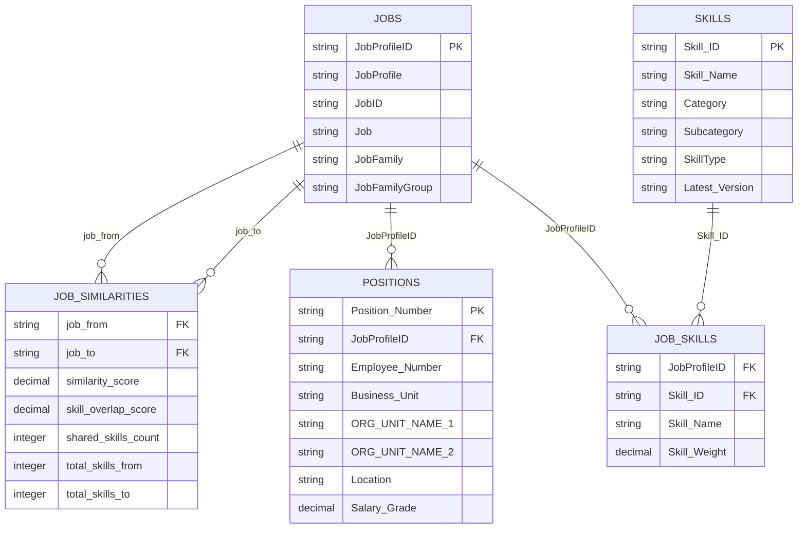

# SQLite Schema Design for NAB Skill Similarity Engine
## Business Context Database

**Generated**: 2025-01-08  
**Version**: 1.0  
**Target**: Flask Webapp Data Layer

---

## Overview

This schema integrates 7 key datasets into a cohesive SQLite database that supports:
- **Career pathway exploration** (job similarity + business context)
- **White paper generation** (employee context + job progression)  
- **Team transition planning** (org hierarchy + workforce distribution)
- **Skills analysis** (comprehensive skills taxonomy + job mappings)

## Design Principles

1. **Simplicity over optimisation**: Readable joins, minimal denormalisation
2. **Logical relationships**: Clear foreign keys matching business understanding
3. **Query-friendly**: Support webapp filtering without complex indexing strategies
4. **Future-proof**: Schema can evolve with additional datasets

---

## Core Entity Relationships



---

## Table Definitions

### 1. **jobs** - Job Architecture Master Data
*Source: `data/job_architecture/dummy_job_architecture.csv`*

```sql
CREATE TABLE jobs (
    JobProfileID TEXT PRIMARY KEY,           -- R0001.5 format
    JobProfile TEXT NOT NULL,               -- "Analyst - Risk Management"
    JobID TEXT,                             -- Hierarchical job code
    Job TEXT,                               -- Job title
    JobFamily TEXT,                         -- "Technology", "Risk", "Finance"
    JobFamilyGroup TEXT                     -- Higher-level grouping
);
```

**Key Insights**: 717 unique jobs, JobProfileID is our central linking key across all systems.

### 2. **job_similarities** - Pre-computed Job-to-Job Similarities
*Source: `models/2025-Q2/precompute_*/job_similarity_matrix.parquet`*

```sql
CREATE TABLE job_similarities (
    job_from TEXT NOT NULL,                 -- Source JobProfileID
    job_to TEXT NOT NULL,                   -- Target JobProfileID  
    similarity_score REAL NOT NULL,        -- Overall similarity (0-1)
    skill_overlap_score REAL,              -- Skills-specific similarity
    shared_skills_count INTEGER,           -- Number of overlapping skills
    total_skills_from INTEGER,             -- Total skills for source job
    total_skills_to INTEGER,               -- Total skills for target job
    
    PRIMARY KEY (job_from, job_to),
    FOREIGN KEY (job_from) REFERENCES jobs(JobProfileID),
    FOREIGN KEY (job_to) REFERENCES jobs(JobProfileID)
);
```

**Key Insights**: 510,510 similarity pairs with 100% coverage of all JobProfileIDs.

### 3. **positions** - Workforce Context (Simplified)
*Source: `data/workforce_context/dummy_workforce_context.csv`*

```sql
CREATE TABLE positions (
    Position_Number TEXT PRIMARY KEY,       -- Unique position identifier
    JobProfileID TEXT,                      -- Link to job architecture
    Employee_Number TEXT,                   -- Current employee (if filled)
    
    -- Business Context
    Business_Unit TEXT,                     -- "Personal Banking", "Technology"
    Function TEXT,                          -- Derived from org units
    Department TEXT,                        -- ORG_UNIT_NAME_1
    Team TEXT,                              -- ORG_UNIT_NAME_2
    
    -- Geographic Context  
    Location TEXT,                          -- "Melbourne", "Sydney"
    State TEXT,                             -- "VIC", "NSW"
    Country TEXT,                           -- "Australia"
    
    -- Employment Details
    Employment_Type TEXT,                   -- "Permanent", "Contract"
    Salary_Grade REAL,                      -- Numeric grade
    Work_Pattern TEXT,                      -- "Full Time", "Part Time"
    
    FOREIGN KEY (JobProfileID) REFERENCES jobs(JobProfileID)
);
```

**Design Decision**: Flattened org hierarchy (keep top 3-4 levels) instead of separate hierarchy table for query simplicity.

### 4. **skills** - Comprehensive Skills Library
*Source: `data/skills_library/lightcast_skills_comprehensive.csv`*

```sql
CREATE TABLE skills (
    Skill_ID TEXT PRIMARY KEY,              -- Lightcast skill identifier
    Skill_Name TEXT NOT NULL,               -- "Python Programming"
    Category TEXT,                          -- "Technology"
    Subcategory TEXT,                       -- "Programming Languages"
    SkillType TEXT,                         -- "Hard Skill", "Soft Skill"
    Latest_Version TEXT,                    -- Version tracking
    
    -- Additional metadata
    Market_Demand TEXT,                     -- "High", "Medium", "Low"
    Rarity_Score REAL                       -- 0-1 scale for skill uniqueness
);
```

**Key Insights**: 38,395 skills from Lightcast API with rich taxonomy structure.

### 5. **job_skills** - Job-to-Skills Mapping
*Source: `data/input_data/job_skill_mapping.csv`*

```sql
CREATE TABLE job_skills (
    JobProfileID TEXT NOT NULL,             -- Link to jobs table
    Skill_ID TEXT,                          -- Link to skills table (nullable for legacy)
    Skill_Name TEXT NOT NULL,               -- For compatibility with existing data
    Skill_Weight REAL DEFAULT 1.0,         -- Importance weight (0-1)
    
    PRIMARY KEY (JobProfileID, Skill_Name),
    FOREIGN KEY (JobProfileID) REFERENCES jobs(JobProfileID),
    FOREIGN KEY (Skill_ID) REFERENCES skills(Skill_ID)
);
```

**Design Decision**: Include both Skill_ID and Skill_Name for flexibility between Lightcast and existing skills.

---

## Indexes for Webapp Performance

```sql
-- Job exploration queries
CREATE INDEX idx_jobs_family ON jobs(JobFamily);
CREATE INDEX idx_jobs_family_group ON jobs(JobFamilyGroup);

-- Similarity queries (most important)
CREATE INDEX idx_similarities_from ON job_similarities(job_from, similarity_score DESC);
CREATE INDEX idx_similarities_to ON job_similarities(job_to, similarity_score DESC);
CREATE INDEX idx_similarities_score ON job_similarities(similarity_score DESC);

-- Position filtering 
CREATE INDEX idx_positions_job ON positions(JobProfileID);
CREATE INDEX idx_positions_business_unit ON positions(Business_Unit);
CREATE INDEX idx_positions_location ON positions(Location, State);


-- Skills analysis
CREATE INDEX idx_job_skills_job ON job_skills(JobProfileID);
CREATE INDEX idx_job_skills_skill ON job_skills(Skill_Name);
CREATE INDEX idx_skills_category ON skills(Category, Subcategory);
```

---

## Key Webapp Query Patterns

### **1. Career Pathway Exploration**
```sql
-- "Find similar roles to Data Scientist in Technology"
SELECT j2.JobProfile, js.similarity_score, j2.JobFamily
FROM job_similarities js
JOIN jobs j1 ON js.job_from = j1.JobProfileID  
JOIN jobs j2 ON js.job_to = j2.JobProfileID
WHERE j1.JobProfile LIKE '%Data Scientist%'
  AND j2.JobFamily = 'Technology'
  AND js.similarity_score > 0.5
ORDER BY js.similarity_score DESC;
```

### **2. Geographic Opportunity Filtering**
```sql
-- "Show Melbourne Technology roles similar to my current role"
SELECT DISTINCT j.JobProfile, js.similarity_score, COUNT(p.Position_Number) as available_positions
FROM job_similarities js
JOIN jobs j ON js.job_to = j.JobProfileID
JOIN positions p ON j.JobProfileID = p.JobProfileID
WHERE js.job_from = 'R0123.4'  -- Current role
  AND j.JobFamily = 'Technology'
  AND p.Location = 'Melbourne'
  AND p.Employee_Number IS NULL  -- Vacant positions
GROUP BY j.JobProfileID, js.similarity_score
ORDER BY js.similarity_score DESC;
```

### **3. Skills Gap Analysis**
```sql
-- "What skills do I need for target role?"
SELECT s.Skill_Name, s.Category,
       CASE WHEN current_skills.Skill_Name IS NULL THEN 'MISSING' ELSE 'HAVE' END as status
FROM job_skills target_skills
JOIN skills s ON target_skills.Skill_Name = s.Skill_Name
LEFT JOIN job_skills current_skills ON current_skills.Skill_Name = target_skills.Skill_Name 
  AND current_skills.JobProfileID = 'R0123.4'  -- Current role
WHERE target_skills.JobProfileID = 'R0567.8'   -- Target role
ORDER BY status, s.Category;
```

### **4. Team Context Analysis**
```sql
-- "Who in my business unit has done this role?"
SELECT p.Employee_Number, p.Department, j.JobProfile
FROM positions p
JOIN jobs j ON p.JobProfileID = j.JobProfileID
WHERE p.Business_Unit = 'Technology'
  AND j.JobProfile LIKE '%Data%'
  AND p.Employee_Number IS NOT NULL;
```

---

## Data Integration Strategy

### **Phase 1: Core Schema Creation**
1. Create empty SQLite database with schema
2. Load job architecture data (717 records)
3. Load skills library (38K records) 
4. Load job-skill mappings (40K relationships)

### **Phase 2: Similarity Data Integration**
1. Load pre-computed job similarities (510K pairs)
2. Validate 100% JobProfileID coverage
3. Add similarity metadata and scoring

### **Phase 3: Workforce Context**
1. Load position data (5K records)
2. Create position-to-job mappings
3. Validate organisational hierarchy integrity

### **Validation Checkpoints**
- All JobProfileIDs in similarities exist in jobs table
- All Position JobProfileIDs exist in jobs table  
- No orphaned skills in job_skills table
- Org hierarchy integrity (leaders exist as positions)

---

## CLI Integration Plan

### **New Menu Structure** (extends existing `main.py`)
```
Main Menu:
1. Precompute Skill Similarities     # EXISTING
2. Generate Business Context Database # NEW  
3. Query Skill Similarities          # FUTURE
0. Exit

Business Context Menu:
1. Create SQLite schema
2. Load job architecture data
3. Load skills library data  
4. Load workforce context data
5. Load similarity matrices
6. Validate database integrity
7. Generate complete database
0. Back to main menu
```

### **Implementation Modules**
```
src/skill_similarity_engine/business_context/
├── __init__.py
├── schema_builder.py       # SQLite schema creation
├── data_loader.py          # CSV → SQLite loaders  
├── similarity_integrator.py # Parquet → SQLite
├── validator.py            # Data integrity checks
└── orchestrator.py         # CLI menu integration
```

---

## Output Location & Versioning

### **Database Output**
```
models/2025-Q2/precompute_20250608/
├── job_similarity_matrix.parquet    # EXISTING similarity data
├── job_similarity_matrix.csv        # EXISTING Power BI export
└── business_context.sqlite           # NEW comprehensive database
```

### **Benefits of CLI Generation**
- **Version consistency**: Database tied to similarity computation quarter
- **Data governance**: Controlled processing environment
- **Performance**: Pre-computed joins for fast webapp queries
- **Deployment**: Single SQLite file for webapp distribution
- **Validation**: Built-in data integrity checking

---

## Schema Evolution Strategy

### **Current Schema (v1.0)**
- Core job similarities with business context
- Basic skills taxonomy integration
- Simplified org hierarchy (3-4 levels)

### **Future Extensions (v2.0+)**
- Skills prerequisite relationships
- Career pathway history tracking  
- Workforce demand signals
- Enhanced geographic context

### **Backwards Compatibility**
- Additive schema changes only
- Version metadata in database
- Migration scripts for schema updates

---

## Performance Expectations

### **Database Size Estimates**
- **jobs**: ~100KB (717 records)
- **job_similarities**: ~50MB (510K records) 
- **positions**: ~5MB (5K records)
- **skills**: ~5MB (38K records)
- **job_skills**: ~5MB (40K records)
- **Total**: ~65MB SQLite database

### **Query Performance**
- **Simple filters**: <100ms (job family, location)
- **Similarity queries**: <500ms (with proper indexes)
- **Complex joins**: <2 seconds (acceptable for webapp)
- **Skills analysis**: <1 second (pre-indexed)

### **Scalability Notes**
- Current scale well within SQLite limits
- Production scale (2K jobs) → ~200MB database
- No complex optimisation needed at this scale

---

## Summary

This schema design prioritises:
✅ **Simplicity**: Clear relationships, readable queries  
✅ **Functionality**: Supports all key webapp use cases
✅ **Integration**: Clean CLI-based generation process
✅ **Performance**: Adequate speed without over-engineering
✅ **Evolution**: Can grow with additional datasets

The design directly implements your domain insights:
- Job similarities as central hub connecting to all context
- Position-workforce bridge via job mappings
- Skills library integration with job-skill relationships  
- Simplified org hierarchy without unnecessary normalisation

**Next Step**: Implement CLI business context generation modules to create this schema. 

erDiagram
    JOBS {
        string JobProfileID PK
        string JobProfile
        string JobID  
        string Job
        string JobFamily
        string JobFamilyGroup
    }
    
    JOB_SIMILARITIES {
        string job_from FK
        string job_to FK
        decimal similarity_score
        decimal skill_overlap_score
        integer shared_skills_count
        integer total_skills_from
        integer total_skills_to
    }
    
    POSITIONS {
        string Position_Number PK
        string JobProfileID FK
        string Employee_Number
        string Business_Unit
        string ORG_UNIT_NAME_1
        string ORG_UNIT_NAME_2
        string Location
        decimal Salary_Grade
    }
    
    SKILLS {
        string Skill_ID PK
        string Skill_Name
        string Category
        string Subcategory
        string SkillType
        string Latest_Version
    }
    
    JOB_SKILLS {
        string JobProfileID FK
        string Skill_ID FK
        string Skill_Name
        decimal Skill_Weight
    }
    
    JOBS ||--o{ JOB_SIMILARITIES : "job_from"
    JOBS ||--o{ JOB_SIMILARITIES : "job_to"
    JOBS ||--o{ POSITIONS : "JobProfileID"
    JOBS ||--o{ JOB_SKILLS : "JobProfileID"
    SKILLS ||--o{ JOB_SKILLS : "Skill_ID"