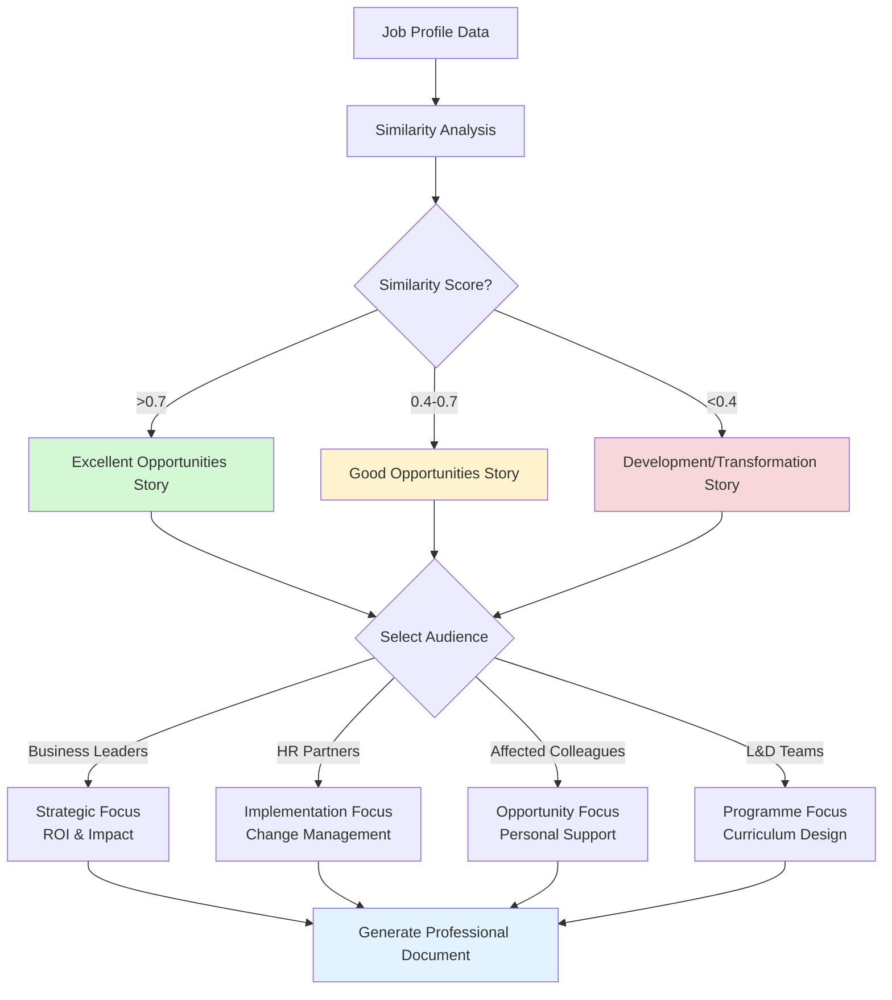

# White Paper Story Mapping & Content Architecture
## NAB Skills Intelligence Platform - Phase 8.2.6

**Document Purpose**: Comprehensive mapping of story types, audience adaptations, and content generation logic for automated white paper creation using refined JobProfile-Position communication framework.

**Version**: 1.2  
**Date**: December 2024  
**Status**: Prototype Complete - Implementation Phase

**🏢 Communication Framework**: JobProfile-first approach maintaining technical accuracy while providing immediate business context through Position Name translation. Balances HR architectural precision with operational recognition.

**🎉 Current Progress**: 
- ✅ White paper structure generation successfully tested
- ✅ Story type classification working ("excellent_opportunities")
- ✅ Confidence assessment integrated ("High")
- ✅ Database integration with 715 job profiles operational
- ✅ Refined business communication framework implemented (JobProfile-first with Position translation)
- 📋 Next: Flask webapp integration for user interface

# White Paper Generation Experimentation
## NAB Skills Intelligence Platform - Phase 8.2.6

**Purpose**: Experiment with automated white paper generation for the Future Skills Team

**Scope**: Understand audiences, scenarios, and data-driven storytelling for role transition reports

**Date**: December 2024

---

## 1. Audience Analysis

### Primary User: Future Skills Team
- **Role**: Strategic workforce analysts and planners
- **Needs**: Professional, data-backed reports to present transition options
- **Technical Level**: Moderate - understand methodology but need executive-ready outputs

### Secondary Audiences (Report Recipients):

#### 1. **Business Leaders & Division Heads**
- **Context**: Receiving reports about role transitions in their divisions
- **Needs**: Executive summary, impact assessment, clear recommendations
- **Language**: Strategic, business-focused, outcome-oriented

#### 2. **HR Business Partners**
- **Context**: Supporting employee transitions and workforce planning
- **Needs**: Practical guidance, timelines, development pathways
- **Language**: HR terminology, people-focused, actionable

#### 3. **Affected Colleagues/Employees**
- **Context**: Understanding their career options during role changes
- **Needs**: Personal relevance, clear pathways, skill development guidance
- **Language**: Supportive, opportunity-focused, accessible

#### 4. **Learning & Development Teams**
- **Context**: Designing training programs for transitions
- **Needs**: Skill gaps, development priorities, learning pathways
- **Language**: Educational, competency-focused, structured

---

## 2. Scenario Analysis

### Common Scenarios Requiring White Papers:

#### Scenario A: **Role Sunsetting**
- **Trigger**: Technology change, process automation, business model shift
- **Affected**: 5-50 people in similar roles
- **Urgency**: Medium-High (3-12 month timeline)
- **Story Focus**: "Where can these skills be applied?"

#### Scenario B: **Division Restructure**
- **Trigger**: Organisational change, merger, cost optimisation
- **Affected**: 20-200 people across multiple roles
- **Urgency**: High (1-6 month timeline)
- **Story Focus**: "How do we redeploy this talent?"

#### Scenario C: **Proactive Career Planning**
- **Trigger**: Future skills strategy, succession planning
- **Affected**: High-potential individuals or critical roles
- **Urgency**: Low-Medium (6-24 month timeline)
- **Story Focus**: "What are the growth opportunities?"

#### Scenario D: **Skills Gap Analysis**
- **Trigger**: New technology adoption, strategic capability building
- **Affected**: Teams needing to upskill or pivot
- **Urgency**: Medium (3-18 month timeline)
- **Story Focus**: "How do we build these capabilities?"

#### Scenario E: **Emergency Redeployment**
- **Trigger**: Market shock, regulatory change, crisis response
- **Affected**: Variable, often cross-functional
- **Urgency**: Very High (immediate to 3 months)
- **Story Focus**: "Who can adapt quickly?"

---

## 3. Data-Driven Story Types

### Story Architecture Based on Data Patterns:

#### **High Similarity Story** (Similarity > 0.7)
- **Narrative**: "Excellent transition opportunities available"
- **Focus**: Multiple viable pathways, low development effort
- **Tone**: Optimistic, opportunity-rich
- **Evidence**: Similarity scores, shared skills, position availability

#### **Medium Similarity Story** (Similarity 0.4-0.7)
- **Narrative**: "Strategic development opportunities with support"
- **Focus**: Targeted skill development, bridging pathways
- **Tone**: Realistic, development-oriented
- **Evidence**: Skill gaps, development timelines, success precedents

#### **Low Similarity Story** (Similarity < 0.4)
- **Narrative**: "Transformation opportunities requiring investment"
- **Focus**: Fundamental reskilling, longer-term transitions
- **Tone**: Honest but supportive, investment-focused
- **Evidence**: Transferable skills, alternative pathways, support programs

#### **Geographic Mobility Story**
- **Narrative**: "Expanded opportunities through location flexibility"
- **Focus**: Different locations offering better role matches
- **Evidence**: Position distribution, location-specific opportunities

#### **Cross-Division Story**
- **Narrative**: "Fresh perspectives through cross-functional moves"
- **Focus**: Applying skills in different business contexts
- **Evidence**: Cross-family similarity data, cultural fit indicators

---

## 1. Executive Summary

This document defines the story architecture for the NAB Skills Intelligence Platform's white paper generation system. It maps data-driven narratives to specific audiences and scenarios, ensuring that each generated report tells the most relevant and actionable story based on:

- **Data patterns** (similarity scores, pathway availability, workforce impact)
- **Target audience** (business leaders, HR partners, affected colleagues, learning teams)
- **Business scenario** (role sunsetting, division restructure, proactive planning, etc.)
- **Urgency level** (immediate, planned, long-term investment)

---

## 2. Core Story Architecture

### 2.1 Intelligent Flow Chart Logic

The white paper generation system follows an intelligent branching logic that transforms raw workforce data into appropriate narratives:



**Key Decision Points:**
- **Data Analysis**: Leverage 510,510 pre-computed job similarities and 8,580 career pathways
- **Story Selection**: Automatic branching based on similarity thresholds and pathway availability
- **Audience Adaptation**: Same core data, four distinct narrative approaches
- **Document Generation**: Professional NAB-styled outputs with appropriate business language

### 2.2 Primary Story Types (Data-Driven)

#### 🚀 **Excellent Opportunities Story**
**Trigger**: High similarity scores (0.7+), multiple pathway options
```
Narrative Framework:
- "Multiple excellent transition opportunities identified"
- "Smooth pathway transitions with minimal disruption"
- "Strong skill alignment across several target roles"

Key Messages:
- Confidence in successful transitions
- Choice and flexibility for affected colleagues
- Low business disruption risk
- Minimal training investment required
```

#### ⭐ **Good Opportunities Story**
**Trigger**: Mixed high/medium similarity, solid pathway options
```
Narrative Framework:
- "Strong transition opportunities with manageable development"
- "Clear pathways available with targeted skill building"
- "Strategic development investment yields strong outcomes"

Key Messages:
- Viable transitions with focused support
- 3-6 month development timeline
- Good return on development investment
- Structured pathway progression
```

#### 🔧 **Development Opportunities Story**
**Trigger**: Medium similarity scores, development-focused pathways
```
Narrative Framework:
- "Strategic development opportunities requiring focused upskilling"
- "Transformation potential through comprehensive skill building"
- "Investment in capability expansion with clear outcomes"

Key Messages:
- Requires strategic development investment
- 6-12 month transformation timeline
- Skill building creates new opportunities
- Comprehensive support programs needed
```

#### 🎯 **Transformation Required Story**
**Trigger**: Low similarity scores, limited direct pathways
```
Narrative Framework:
- "Significant transformation opportunities requiring strategic investment"
- "Major career pivot potential with extensive support"
- "Alternative approaches and external options consideration"

Key Messages:
- Major reskilling investment required
- Long-term career transformation focus
- Consider external recruitment for urgent needs
- Comprehensive career counselling support
```

### 2.2 Story Modifiers & Variations

#### Geographic Mobility Modifier
```
When position data shows location-based opportunities:
+ "Enhanced opportunities through geographic flexibility"
+ "Different locations offer expanded pathway options"
+ "Strategic location-based role matching available"
```

#### Cross-Functional Modifier
```
When pathways span multiple job families:
+ "Cross-functional opportunities expand career horizons"
+ "Skill transferability across business domains"
+ "Fresh perspectives through departmental mobility"
```

#### Career Progression Modifier
```
When pathways include seniority advancement:
+ "Career advancement opportunities identified"
+ "Leadership progression pathways available"
+ "Senior role transition potential"
```

---

## 3. Audience-Specific Adaptations

### 3.1 Business Leaders & Division Heads

**Context**: Strategic decision-makers needing impact assessment and business continuity focus

#### Content Priorities:
1. **Executive Summary** (2-3 paragraphs)
2. **Business Impact Assessment** (risk, timeline, cost)
3. **Strategic Recommendations** (clear action items)
4. **Resource Requirements** (budget, timeline, support needs)

#### Language Style:
- **JobProfile-first communication** with Position Name translation
- ROI and impact emphasis with organizational context
- Clear timelines and milestones
- Risk assessment and mitigation

#### **🏢 Refined Business Communication Framework**:
- **JobProfile-First Approach**: "The Analyst - Data Governance Specialist job architecture"
- **Position Translation**: "which encompasses positions including Data Manager (3), Risk Senior Developer (5), Technology Principal Specialist (8)"
- **Complete Structure**: "The [JobProfile] job architecture, which encompasses positions including [Position Names with counts]"
- **Technical Foundation**: One JobProfile → Many Positions (1:many relationship)
- **Geographic Context**: "Data Manager positions: Melbourne (2), Sydney (1)" for operational clarity

#### Sample Paragraph Templates:

**Excellent Opportunities - Business Leaders**:
```
"Analysis indicates smooth transition prospects for colleagues in the [JobProfile] 
job architecture, which encompasses positions including [Position Names with counts]. 
Multiple high-similarity pathways (average similarity: [X]%) provide excellent 
redeployment options with minimal business disruption. Recommended approach: proceed 
with confidence through a managed 6-8 week transition process. Expected outcome: 
successful redeployment with [X]% skill utilisation retention."
```

**Development Opportunities - Business Leaders**:
```
"Strategic development investment is required to enable successful transitions for the 
[JobProfile] job architecture, which encompasses positions including [Position Names with counts]. 
Analysis identifies viable pathways requiring 6-12 month development programmes. Investment: 
£[X]k in training and support. Expected ROI: retention of [X]% of institutional knowledge 
with enhanced capability in [target areas]. Alternative: external recruitment at estimated 
cost of £[X]k with 3-6 month onboarding."
```

### 3.2 HR Business Partners

**Context**: Practical implementation focus, employee support, process design

#### Content Priorities:
1. **Individual Impact Assessment** (people-focused)
2. **Implementation Roadmap** (detailed phases)
3. **Support Requirements** (counselling, training, facilitation)
4. **Success Metrics** (transition success indicators)

#### Language Style:
- People-centric terminology
- Process and timeline focus
- Support mechanism emphasis
- Change management perspective

#### Sample Paragraph Templates:

**Good Opportunities - HR Partners**:
```
"The [X] colleagues affected by this change have strong transition prospects with targeted 
development support. Recommended approach: individual assessment meetings (Week 1-2), 
followed by personalised development planning (Week 3-4), leading to role matching and 
transition support (Months 2-4). Key support requirements: career counselling, skills 
assessment, and development programme coordination. Success metrics: [X]% successful 
placement within [timeline]."
```

**Transformation Required - HR Partners**:
```
"Comprehensive career transition support is required for colleagues in [Role] positions. 
Recommended approach: immediate career counselling initiation, extensive skills assessment, 
and long-term development planning. Timeline: 12-18 months for full transition. Support 
requirements: dedicated career coaches, comprehensive reskilling programmes, and ongoing 
mentorship. Consider phased transition to minimise personal impact."
```

### 3.3 Affected Colleagues/Employees

**Context**: Personal impact focus, opportunity emphasis, supportive messaging

#### Content Priorities:
1. **Personal Opportunity Assessment** (what this means for you)
2. **Career Development Pathways** (your future options)
3. **Skills Recognition** (value of current capabilities)
4. **Support Available** (help throughout transition)

#### Language Style:
- Supportive and encouraging tone
- Opportunity-focused messaging
- Personal development emphasis
- Clear next steps and support

#### Sample Paragraph Templates:

**Excellent Opportunities - Affected Colleagues**:
```
"Your skills and experience in [Role] are highly transferable and valuable. Analysis 
shows you have excellent options in [X] different career directions, with [Y] roles 
showing strong alignment (over 70% skill match). This transition offers exciting 
opportunities to [specific benefits]. Next steps: career discussion meetings to explore 
preferences, followed by transition planning and support. You're in a strong position 
with multiple attractive pathways ahead."
```

**Development Opportunities - Affected Colleagues**:
```
"Your foundation skills in [Role] provide an excellent platform for exciting career 
development opportunities. While some focused skill building is recommended, this 
represents a chance to expand your capabilities and access [X] new career directions. 
Development focus areas: [specific skills]. Support available: comprehensive training 
programmes, mentoring, and career coaching throughout your journey. This transformation 
will significantly expand your career options and earning potential."
```

### 3.4 Learning & Development Teams

**Context**: Programme design focus, curriculum development, delivery planning

#### Content Priorities:
1. **Skills Gap Analysis** (what needs to be developed)
2. **Learning Pathway Design** (curriculum recommendations)
3. **Programme Specifications** (delivery method, duration, assessment)
4. **Success Measurement** (learning outcomes, competency validation)

#### Language Style:
- Educational and competency-focused
- Structured learning approach
- Assessment and validation emphasis
- Programme design specificity

#### Sample Paragraph Templates:

**Good Opportunities - Learning Teams**:
```
"Skills analysis indicates targeted development requirements across [X] core competency 
areas for successful role transitions. Recommended programme structure: [duration] 
modular approach covering [specific skills]. Delivery method: blended learning with 
[X]% practical application. Assessment strategy: competency-based validation with 
workplace application projects. Expected outcomes: [X]% competency achievement enabling 
successful role transition within [timeline]."
```

**Transformation Required - Learning Teams**:
```
"Comprehensive reskilling programme required spanning [duration] across [X] major 
competency domains. Programme architecture: foundation phase ([timeline]) focusing on 
[core skills], followed by specialisation phase ([timeline]) in [specific areas]. 
Delivery strategy: intensive blended approach with extensive practical application. 
Success criteria: achievement of [specific competency levels] validated through 
[assessment methods]. Consider external partnerships for specialised content delivery."
```

---

## 4. Scenario-Based Branching Logic

### 4.1 Role Sunsetting Scenario

**Business Context**: Technology change, automation, process optimisation

#### Story Branching:
```
Data Analysis → Story Selection → Audience Adaptation

IF similarity > 0.7 AND pathways >= 3:
    → Excellent Opportunities Story
    → Focus: "Smooth redeployment with minimal disruption"
    → Timeline: 6-12 weeks

ELIF similarity > 0.4 OR pathways >= 2:
    → Good Opportunities Story  
    → Focus: "Strategic redeployment with development support"
    → Timeline: 3-6 months

ELIF pathways >= 1:
    → Development Opportunities Story
    → Focus: "Transformation through comprehensive development"
    → Timeline: 6-12 months

ELSE:
    → Transformation Required Story
    → Focus: "Strategic career transformation or external options"
    → Timeline: 12-18 months
```

#### Audience-Specific Focus:
- **Business Leaders**: Impact minimisation, cost analysis, timeline certainty
- **HR Partners**: Change management, employee support, communication strategy
- **Affected Colleagues**: Opportunity focus, skills recognition, future pathways
- **Learning Teams**: Reskilling programme design, competency frameworks

### 4.2 Division Restructure Scenario

**Business Context**: Organisational change, merger, strategic realignment

#### Story Branching:
```
Volume Analysis → Complexity Assessment → Resource Planning

IF affected_people > 50:
    → Large Scale Transformation Focus
    → Emphasise: programme management, phased approach
    
IF cross_division_moves > 30%:
    → Cross-Functional Integration Focus
    → Emphasise: cultural adaptation, knowledge transfer
    
IF timeline < 6_months:
    → Rapid Deployment Focus
    → Emphasise: immediate actions, priority sequencing
```

### 4.3 Proactive Planning Scenario

**Business Context**: Future skills strategy, succession planning, capability building

#### Story Branching:
```
Strategic Focus → Development Planning → Investment Justification

IF high_potential_individuals:
    → Strategic Investment Story
    → Focus: leadership development, succession readiness
    
IF emerging_skills_requirements:
    → Future Capability Story
    → Focus: competitive advantage, skill adjacency
    
IF long_term_planning > 18_months:
    → Strategic Development Story
    → Focus: systematic capability building, market positioning
```

---

## 5. Content Generation Templates

### 5.1 Executive Summary Template

```markdown
## Executive Summary

### Situation Overview
[Dynamic content based on workforce impact analysis]
Analysis of transition opportunities for {workforce_count} colleagues currently in {role_name} roles across {divisions_affected} divisions and {locations_affected} locations.

### Key Finding
[Story-specific narrative from branching logic]
{narrative_statement}

### Strategic Recommendation
[Scenario and story-specific recommendation]
{recommendation_summary}

### Implementation Confidence
[Audience-specific confidence statement]
{audience_confidence_statement}

### Impact Assessment
[Business impact summary]
{impact_summary}
```

### 5.2 Section Templates

#### Section 1: Context & Current State
```markdown
## 1. Context & Current State

### Role Overview
The {job_profile} job architecture within the {job_family} family encompasses positions including {position_names_with_counts}. 

### Workforce Impact
Current deployment: {position_count} colleagues across {organizational_structure} in positions including {position_distribution}.

### Business Context
{scenario_context} has created the need for {transition_type} analysis.

### Analysis Scope
This assessment covers {analysis_scope} using the NAB Skills Intelligence Platform.
```

#### Section 2: Transition Opportunity Analysis
```markdown
## 2. Transition Opportunity Analysis

### Pathway Assessment
Analysis identified {pathway_count} viable career pathways with an average similarity score of {avg_similarity} (scale 0-1).

### Top Opportunities
{pathway_list_with_details}

### Movement Type Analysis
- Career Advancement: {progression_count} pathways
- Cross-Functional: {cross_family_count} pathways  
- Lateral Movement: {lateral_count} pathways

### Opportunity Quality Assessment
{quality_assessment_narrative}
```

#### Section 3: Skills Development Requirements
```markdown
## 3. Skills Development Requirements

### Skills Overlap Analysis
Current role skills analysis across {pathway_count} potential pathways:
- Average shared skills: {avg_shared_skills}
- Range: {min_shared_skills}-{max_shared_skills} skills overlap

### Development Priority Areas
{development_priorities_based_on_similarity}

### Training Investment Analysis
{training_investment_assessment}

### Success Probability Assessment
{success_probability_based_on_skill_gaps}
```

#### Section 4: Implementation Roadmap
```markdown
## 4. Implementation Roadmap

### Phase 1: {phase_1_timeline}
{phase_1_activities}

### Phase 2: {phase_2_timeline}
{phase_2_activities}

### Phase 3: {phase_3_timeline}
{phase_3_activities}

### Success Criteria
{measurable_success_criteria}

### Resource Requirements
{resource_requirements_summary}

### Risk Mitigation
{risk_mitigation_strategies}
```

---

## 6. Content Personalisation Rules

### 6.1 Dynamic Content Variables

```python
# Data-driven variables
jobprofile_name = f"{job_data['JobProfile']}"
position_summary = f"{', '.join([f'{name} ({count})' for name, count in position_data.items()])}"
workforce_count = f"{impact_data['total_positions']} colleagues"
similarity_score = f"{avg_similarity:.1%}"
pathway_strength = "excellent" if avg_similarity > 0.7 else "strong" if avg_similarity > 0.4 else "developing"

# Audience-specific variables
urgency_language = {
    'business_leaders': "immediate attention required",
    'hr_partners': "structured transition planning needed", 
    'affected_colleagues': "exciting opportunities ahead",
    'learning_teams': "comprehensive development programme design required"
}

# Communication framework variables
jobprofile_intro = f"The {jobprofile_name} job architecture"
position_context = f"which encompasses positions including {position_summary}"
full_narrative = f"{jobprofile_intro}, {position_context}"

# Scenario-specific variables
timeline_emphasis = {
    'role_sunsetting': "transition efficiency",
    'division_restructure': "organisational stability",
    'proactive_planning': "strategic development",
    'emergency_redeployment': "rapid deployment capability"
}
```

### 6.2 Tone and Language Adaptation

#### Confident Tone (Excellent Opportunities):
```
- "Strong alignment identified"
- "Multiple viable pathways"
- "Smooth transition expected"
- "Excellent prospects"
- "Proceed with confidence"
```

#### Supportive Tone (Development Opportunities):
```
- "Solid foundation for development"
- "Strategic investment opportunity"
- "Comprehensive support available"
- "Transformation potential"
- "Structured development approach"
```

#### Realistic Tone (Transformation Required):
```
- "Significant investment required"
- "Long-term commitment needed"
- "Alternative approaches considered"
- "Comprehensive support essential"
- "Strategic patience recommended"
```

---

## 7. Quality Assurance Framework

### 7.1 Content Validation Rules

#### Data Accuracy Checks:
- ✅ Similarity scores within valid range (0-1)
- ✅ Pathway counts match database queries
- ✅ Workforce impact numbers verified
- ✅ Timeline estimates realistic and consistent

#### Narrative Consistency Checks:
- ✅ Story type matches data patterns
- ✅ Audience language appropriate
- ✅ Scenario context accurate
- ✅ Recommendations actionable

#### Professional Standards:
- ✅ NAB tone and terminology
- ✅ Error-free grammar and spelling
- ✅ Consistent formatting and structure
- ✅ Appropriate confidence levels

### 7.2 Human Review Checkpoints

#### Critical Review Points:
1. **Data Interpretation**: Are the insights accurate?
2. **Audience Appropriateness**: Is the language suitable?
3. **Actionability**: Are recommendations implementable?
4. **Sensitivity**: Is the tone appropriate for the situation?

---

## 8. Implementation Roadmap

### Phase 1: Core Template Development ✅ **COMPLETED**
- [x] Build content generation functions using templates above
- [x] Implement branching logic for story selection
- [x] Create audience adaptation functions
- [x] Test with sample data from database
- **Achievement**: Successfully generating "Career Transition Analysis: Analyst - Branch Manager Role Sunset" with "excellent_opportunities" story type

### Phase 2: Dynamic Content Integration (Week 3-4) 📋 **IN PROGRESS**
- [x] Connect templates to live database queries
- [x] Implement variable substitution system
- [ ] Add quality assurance validation
- [ ] Test end-to-end content generation with all story types

### Phase 3: Document Assembly (Week 5-6) 📋 **NEXT**
- [ ] Integrate with python-docx for Word generation
- [ ] Apply NAB branding and formatting
- [ ] Add charts and visualisations from webapp data
- [ ] Test complete document generation across all 4 audiences

### Phase 4: Flask Integration (Week 7-8) 📋 **PLANNED**
- [ ] Create `/white-papers` route in existing Flask webapp
- [ ] Add user selection options (scenario, audience, job selection)
- [ ] Integrate with existing job search and similarity data
- [ ] Implement download functionality (.docx, .pdf, .html)
- [ ] User acceptance testing with Future Skills team

---

## 9. Integration with Existing NAB Skills Intelligence Platform

### 9.1 Webapp Integration Points

The white paper generation system integrates seamlessly with the existing Flask application infrastructure:

#### **Data Sources:**
- **Job Similarities**: 510,510 pre-computed similarity relationships (JobProfile level)
- **Career Pathways**: 8,580 career progression relationships (JobProfile level)
- **Workforce Context**: 5,000 position records across 6 divisions (Position Name level)
- **Skills Taxonomy**: 38,395 skills with 2,091 actively mapped
- **JobProfile-Position Mapping**: One-to-many relationships for business translation

#### **🏢 Business Communication Strategy:**
- **JobProfile Foundation**: Start with technical accuracy from `jobs` table
- **Position Translation**: Map to `positions` table for business-recognisable context
- **Presentation Logic**: "The [JobProfile] job architecture, which encompasses positions including [Position Names with counts]"
- **SQL Strategy**: JOIN jobs → positions for complete business narrative (JobProfile similarity calculations + Position operational context)
- **1:Many Relationship**: One JobProfile → Multiple Position titles with deployment counts

#### **UI Integration:**
- **New Route**: `/white-papers` added to existing navigation
- **Job Selection**: Leverage existing job search functionality
- **Data Visualization**: Reuse D3.js tree components for pathway illustration
- **Export Functions**: Extend existing CSV export patterns for .docx/.pdf

#### **Technical Architecture:**
- **Database Queries**: Extend organized SQL structure in `/sql/` directory
- **Template System**: Integrate with existing Jinja2 template framework
- **API Endpoints**: Add `/api/generate-whitepaper/<job_id>/<audience>/<scenario>`
- **Styling**: Maintain NAB design system consistency with Tailwind CSS

### 9.2 User Journey Enhancement

```
Existing Workflow:
Job Search → Career Pathways → Skills Analysis → Manual Report Creation (2-3 hours)

Enhanced Workflow:  
Job Search → Career Pathways → White Paper Generation → Professional Document (< 30 seconds)
```

## 10. Success Metrics

### Quantitative Measures:
- **Generation Speed**: < 30 seconds per white paper
- **Accuracy Rate**: > 95% data accuracy validation
- **User Adoption**: 80% Future Skills team usage within 3 months
- **Time Savings**: 2-3 hours per transition analysis
- **Integration Performance**: Sub-2-second database queries maintained

### Qualitative Measures:
- **Business Relevance**: Content directly supports decision-making
- **Professional Quality**: Suitable for executive presentation
- **Narrative Coherence**: Stories make logical sense and flow well
- **Actionability**: Recommendations are implementable and specific
- **Platform Consistency**: Seamless user experience with existing tools

---

*This document serves as the foundational design for NAB's automated white paper generation system, ensuring data-driven storytelling that adapts intelligently to audience needs and business scenarios. The system builds upon the robust Skills Intelligence Platform infrastructure to deliver professional-grade workforce transition analysis.* 